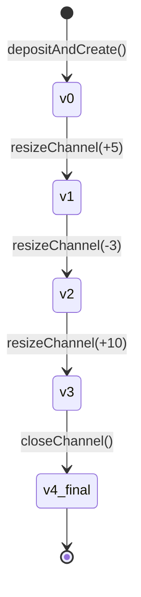

# ClearNode Communication

ClearNode acts as the state channel broker and off-chain coordinator. Understanding how to communicate with it is essential for advanced usage, debugging, and building custom operations.

## Overview

ClearNode communication involves three key steps:

1. **Connect** to ClearNode via WebSocket
2. **Authenticate** with your session key, specifying allowances (how much this key can handle)
3. **Execute operations** - all channel operations (create, resize, close) use the authenticated session key

This guide covers the low-level communication patterns that power `deposit()`, `withdraw()`, and other high-level operations.

## Connection & Authentication

Before performing any channel operations, you must connect and authenticate with ClearNode.

### Establishing the Connection

```typescript
import { connectToClearNode, authenticateClearNode } from './rpc/connection';
import { createWallet } from './core/wallets';

// Create wallet with session key manager
const wallet = createWallet({
  walletClient,
  publicClient,
  sessionKeyManager: keyManager  // Persists session key
});

// Connect to ClearNode
const ws = await connectToClearNode(CLEARNODE_URL);
```

### Authentication with Session Key

When you authenticate, you specify **allowances** - how much value this session key is authorized to handle:

```typescript
// Authenticate with allowances for app sessions
await authenticateClearNode(ws, wallet, [
  {
    asset: 'USDC',
    amount: '10.00'  // This session key can handle up to 10 USDC
  }
]);
```

**What happens during authentication**:
1. ClearNode sends a challenge message
2. Your session key signs the challenge
3. ClearNode verifies the signature
4. Your connection is now authenticated for the specified allowances

### Why This Matters

**All channel operations use the authenticated session key**:
- Creating channels
- Resizing channels (deposit/withdraw)
- Closing channels
- Creating app sessions

The session key you authenticate with becomes the "owner" of any channels you create. You must use the same session key for all future operations on those channels.

**Allowances enable app sessions**: When creating multi-party sessions (like games), ClearNode checks that each participant has authenticated with sufficient allowances to cover their stake.

## WebSocket RPC Pattern

All channel operations (create, resize, close) follow the same WebSocket request/response pattern. Understanding this pattern helps you debug issues and build custom operations.

### The Standard Pattern

```typescript
// 1. Create signed RPC message
const message = await createXXXMessage(wallet.sessionSigner.sign, params);

// 2. Set up response listener BEFORE sending
return new Promise((resolve, reject) => {
  const handleMessage = async (event: MessageEvent) => {
    try {
      const response = parseAnyRPCResponse(event.data);

      // 3. Check method type
      if (response.method === RPCMethod.XXX) {
        ws.removeEventListener('message', handleMessage);  // Cleanup!

        // 4. Parse specific response
        const parsed = parseXXXResponse(event.data);

        // 5. Do blockchain operation
        const txHash = await submitTransaction(parsed.params);

        // 6. Wait for confirmation
        await publicClient.waitForTransactionReceipt({ hash: txHash });

        resolve(txHash);
      }
      else if (response.method === RPCMethod.Error) {
        ws.removeEventListener('message', handleMessage);
        reject(new Error(`ClearNode error: ${JSON.stringify(response.params)}`));
      }
    } catch (error) {
      // Ignore parse errors - might be unrelated messages
    }
  };

  // 7. Set timeout
  const timeoutId = setTimeout(() => {
    ws.removeEventListener('message', handleMessage);
    reject(new Error('Timeout waiting for response'));
  }, 60000);  // 60s for blockchain operations

  // 8. Add listener and send
  ws.addEventListener('message', handleMessage);
  ws.send(message);
});
```

### Why This Pattern?

**Async coordination**: WebSocket messages are async - you send a request, then later receive a response. The Promise wrapper makes this feel synchronous.

**Message filtering**: Your WebSocket receives ALL messages from ClearNode (channel updates, app messages, errors). The `parseAnyRPCResponse` filters for the specific response you're waiting for.

**Cleanup**: Always `removeEventListener` when done, otherwise handlers pile up and cause memory leaks.

**Timeout protection**: Blockchain operations can take 15-30 seconds. The 60s timeout prevents infinite hangs.

**Error handling**: ClearNode sends `RPCMethod.Error` responses for issues like invalid signatures, insufficient balance, or invalid state transitions. Always check for error responses in your message handler.

### Real Example: Channel Creation

```typescript
// rpc/channels.ts:66-193
export async function createChannelViaRPC(
  ws: WebSocket,
  wallet: Wallet,
  amount: string = '10'
): Promise<Hex> {
  return new Promise(async (resolve, reject) => {
    // Setup phase
    const amountWei = parseUSDC(amount);
    await ensureAllowance(wallet, CUSTODY_CONTRACT, amountWei);

    // Message handler
    const handleMessage = async (event: MessageEvent) => {
      try {
        const response = parseAnyRPCResponse(event.data);

        if (response.method === RPCMethod.CreateChannel) {
          ws.removeEventListener('message', handleMessage);

          const { channel, state, serverSignature } = parseCreateChannelResponse(event.data).params;

          // Submit blockchain tx
          const { channelId, txHash } = await nitroliteClient.depositAndCreateChannel(
            tokenAddress,
            amountWei,
            { channel, unsignedInitialState: state, serverSignature }
          );

          // Wait for mining
          await nitroliteClient.publicClient.waitForTransactionReceipt({ hash: txHash });

          resolve(channelId);
        }
        else if (response.method === RPCMethod.Error) {
          ws.removeEventListener('message', handleMessage);
          reject(new Error(`ClearNode error: ${JSON.stringify(response.params)}`));
        }
      } catch (error) {
        // Ignore - might be other messages
      }
    };

    // Timeout
    const timeoutId = setTimeout(() => {
      ws.removeEventListener('message', handleMessage);
      reject(new Error('Timeout waiting for channel creation'));
    }, 60000);

    // Send request
    ws.addEventListener('message', handleMessage);
    const message = await createCreateChannelMessage(wallet.sessionSigner.sign, {
      chain_id: SEPOLIA_CONFIG.chainId,
      token: SEPOLIA_CONFIG.contracts.tokenAddress,
      amount: amountWei,
      session_key: wallet.sessionSigner.address
    });
    ws.send(message);
  });
}
```

## Session Keys & Persistence

Session keys are cryptographic keys used to sign channel state transitions. They are **separate from your wallet's private key** and must be persisted to maintain access to channels.

### Why Session Keys?

**Separation of concerns**: Your main wallet key stays in cold storage. The session key can be used by applications without exposing the main key.

**Channel ownership**: The session key that creates a channel must sign all future operations on that channel.

**Deterministic addresses**: Session keys generate consistent addresses, allowing channels to be recovered across application restarts.

### Session Key Persistence

The session key must be **persisted across application restarts** to continue using existing channels:

```typescript
// Node.js only - for browser, use createLocalStorageKeyManager
import { createFileSystemKeyManager } from './core/key-manager-fs';
import { createWallet } from './core/wallets';
import { createWalletClient, createPublicClient, http } from 'viem';
import { privateKeyToAccount } from 'viem/accounts';
import { sepolia } from 'viem/chains';

// Create key manager (persists to disk)
const keyManager = createFileSystemKeyManager('./keys');

// Create viem account and clients
const account = privateKeyToAccount(walletPrivateKey);

const walletClient = createWalletClient({
  account,
  chain: sepolia,
  transport: http(),
});

const publicClient = createPublicClient({
  chain: sepolia,
  transport: http(),
});

// Create wallet with session key management
const wallet = createWallet({
  walletClient,
  publicClient,
  sessionKeyManager: keyManager
});
```

### Available KeyManager Types

**FileSystem** (Node.js/Backend):
```typescript
const keyManager = createFileSystemKeyManager('./data');
```

**LocalStorage** (Browser):
```typescript
const keyManager = createLocalStorageKeyManager();
```

**In-Memory** (Testing only):
```typescript
const keyManager = createInMemoryKeyManager();
```

### Why Session Keys Matter

The session key determines **channel ownership**. If you lose the session key:
- ❌ Cannot resize existing channels
- ❌ Cannot withdraw funds from channels
- ❌ Must create new channel with new session key
- ⚠️ Old channel funds require on-chain challenge to recover

Always persist session keys in production applications.

### Session Key Consistency

The session key you use to create a channel **must be used for all operations** on that channel:

```typescript
// Create with session key A
const wallet = createWallet({
  sessionKeyManager: createFileSystemKeyManager('./keys/alice')
});
await client.deposit(parseUSDC('10'));  // Creates channel with key A

// ✓ Resize with same session key A
await client.deposit(parseUSDC('5'));   // Works!

// ✗ Try to resize with different session key B
const wallet2 = createWallet({
  sessionKeyManager: createFileSystemKeyManager('./keys/bob')
});
const client2 = createBetterNitroliteClient({ wallet: wallet2 });
await client2.deposit(parseUSDC('5'));  // Error: Signature mismatch
```

**Why?** The channel's initial state records the session key's address. All subsequent states must be signed by that same key, otherwise the contract rejects the signature.

## State Management Deep Dive

Every channel operation involves **state transitions** - moving from one valid state to another. Understanding state structure and management is crucial for debugging and advanced usage.

### Channel State Anatomy

A complete channel state contains these fields:

```typescript
interface ChannelState {
  // Identity
  channelId: Hex;              // Unique identifier (derived from participants + nonce)
  intent: Hex;                 // Adjudicator contract address

  // Versioning
  version: bigint;             // Monotonically increasing (0, 1, 2, ...)
  isFinal: boolean;            // True only when channel is closed

  // State Data
  data: Hex;                   // Encoded application-specific data

  // Fund Allocations
  allocations: [
    {
      destination: Address;    // Participant 1 address
      amount: bigint;          // Their balance in wei
      allocationType: number;  // 0 = simple allocation
      metadata: Hex;           // Additional data
    },
    {
      destination: Address;    // Participant 2 address (broker)
      amount: bigint;
      allocationType: number;
      metadata: Hex;
    }
  ];

  // Signatures
  serverSignature: Hex;        // Broker's signature on this state
  // clientSignature added automatically by SDK
}
```

### State Transitions

Every operation creates a new state with an incremented version:



**Rules**:
1. Version must always increase: `newVersion > currentVersion`
2. Both participants must sign each state (client + broker)
3. State hash must match signed data
4. Channel ID must remain constant
5. Only final states can have `isFinal: true`

### Data Transformations

RPC responses use a different format than the SDK client. The SDK provides conversion helpers:

**RPC Format** (from ClearNode):
```typescript
{
  channel_id: string,
  intent: string,
  version: number,              // Plain number
  state_data: string,
  allocations: [
    {
      destination: string,
      amount: string,           // String representation
      allocation_type: number,
      metadata: string
    }
  ]
}
```

**Client Format** (for NitroliteClient):
```typescript
{
  channelId: Hex,
  intent: Hex,
  version: bigint,              // BigInt
  data: Hex,
  allocations: [
    {
      destination: Address,
      amount: bigint,           // BigInt
      allocationType: number,
      metadata: Hex
    }
  ],
  serverSignature: Hex
}
```

**Conversion** (handled automatically):
```typescript
// Convert RPC state to client format
const clientState = convertRPCToClientState(rpcState, serverSignature);

// The SDK does this inside depositAndCreateChannel, resizeChannel, etc.
```

### Proof States

Proof states validate that a state transition is legitimate. Only the **last on-chain state** is required:

```typescript
// Get current on-chain state
const channelData = await client.getChannelData(channelId);

// Use it as proof
const proofStates = [channelData.lastValidState];

// Submit new state
await client.resizeChannel({
  resizeState: newState,     // version: N+1
  proofStates,               // version: N
});
```

**Why this works**:
1. Contract stores the last valid state version
2. New state must have `version > lastValidState.version`
3. Both signatures validate the transition
4. No need to prove full history - just that you're moving forward

**Example**:
```typescript
// On-chain state: version 5
const channelData = await client.getChannelData(channelId);
// channelData.lastValidState.version === 5n

// ClearNode gives you version 6
const { state } = await resizeChannel(...);
// state.version === 6

// Contract accepts: 6 > 5 ✓
```

### State Signatures

Every state needs two signatures - one from each participant:

```typescript
// 1. Client creates initial request and signs with session key
const message = await createResizeChannelMessage(
  wallet.sessionSigner.sign,  // Your signature function
  { channel_id, resize_amount, allocate_amount, funds_destination }
);

// 2. ClearNode validates, creates new state, and adds broker signature
const response = await sendAndWaitForResponse(ws, message);
const { state, serverSignature } = response.params;

// 3. SDK combines both signatures for on-chain submission
await client.resizeChannel({
  resizeState: {
    ...state,
    serverSignature,          // Broker's signature included
  },
  proofStates,
});
// SDK automatically adds your session key signature inside resizeChannel()
```

### State Version Management

Every channel operation increments the version:

```typescript
// Initial state after creation
{ version: 0n, allocations: [{ amount: 10n }] }

// After first resize (+5)
{ version: 1n, allocations: [{ amount: 15n }] }

// After second resize (-3)
{ version: 2n, allocations: [{ amount: 12n }] }

// After close
{ version: 3n, allocations: [{ amount: 0n }], isFinal: true }
```

If you try to submit an old version, the contract rejects it:

```typescript
// Current on-chain version: 2

// ✗ Try to submit version 1 (old state)
await client.resizeChannel({ version: 1n, ... });
// Error: Version must be greater than current version

// ✓ Submit version 3 (new state)
await client.resizeChannel({ version: 3n, ... });
// Success!
```

## Next Steps

- **[Fund Management](./fund-management)**: Use this knowledge to understand deposit, withdraw, and send operations
- **[Distributed Sessions](./distributed-sessions)**: Apply RPC patterns to multi-party session creation
- **[Session Lifecycle](./session-lifecycle)**: Manage active app sessions with state tracking
