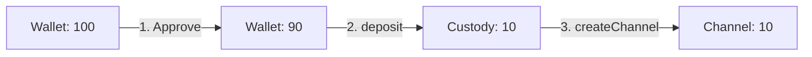
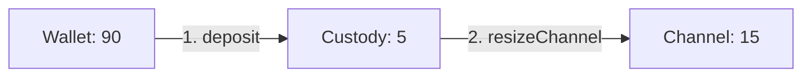
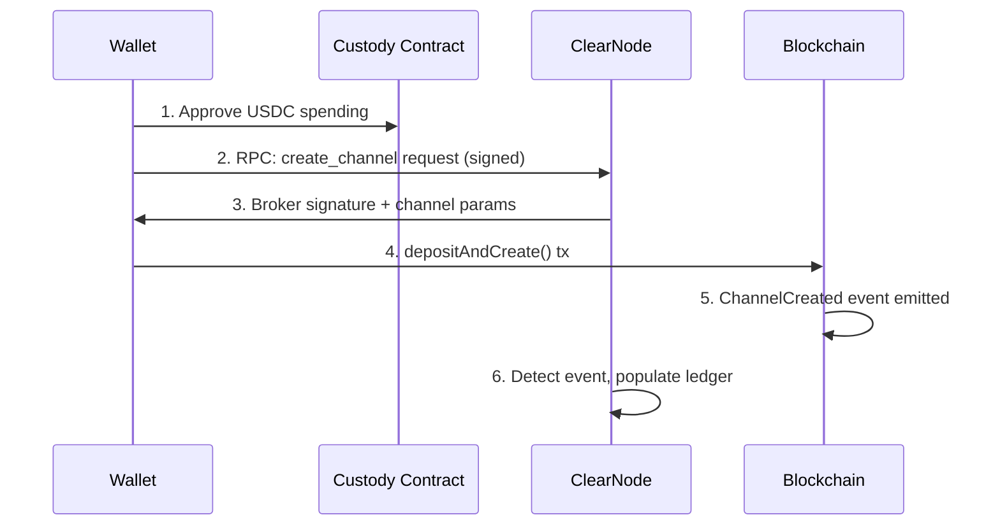
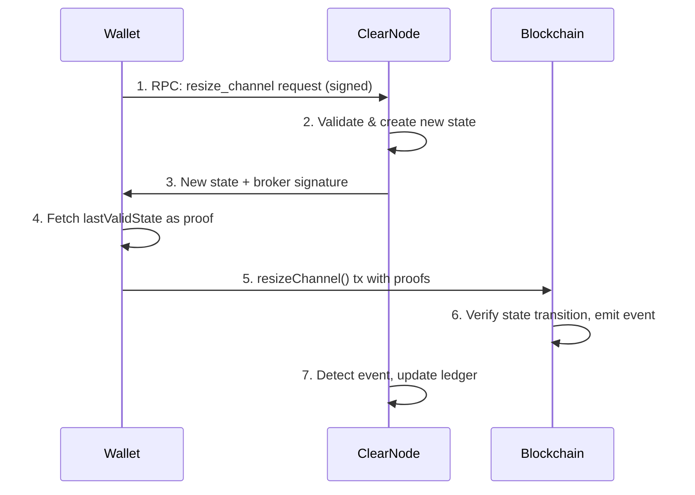
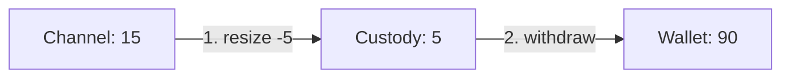
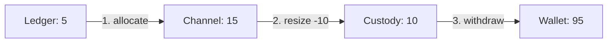
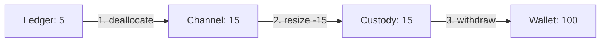
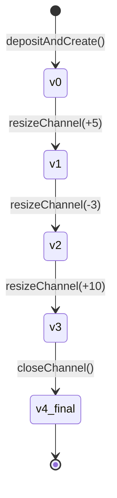

# Fund Management

Fund management is one of the most important - and initially confusing - aspects of Yellow SDK. This guide walks through every operation with diagrams, code examples, and balance checks at each step.

## Overview

Fund management involves moving value through the 4-layer balance system:

```
WALLET ←→ CUSTODY ←→ CHANNEL ←→ LEDGER
```

The `BetterNitroliteClient` provides three high-level methods:
- **`deposit(amount)`** - Move funds from wallet into the channel
- **`withdraw(amount)`** - Move funds from channel back to wallet
- **`send({ to, amount })`** - Transfer value via ledger (peer-to-peer)

Under the hood, these use low-level resize and allocate operations.

## Deposit Flow

**Implementation**: `client.ts:597-699` (`deposit`)

### First Deposit (No Channel Exists)

When you have no channel, `deposit()` creates one:

**Code path**: `client.ts:607-639` (channel creation branch)

```typescript twoslash
import type { BetterNitroliteClient } from '@trivia-royale/game';
import { parseUSDC } from '@trivia-royale/game';

declare const client: BetterNitroliteClient;
// ---cut---
// Starting state
const before = await client.getBalances();
// { wallet: 100, custody: 0, channel: 0, ledger: 0 }

await client.deposit(parseUSDC('10'));
//           ^?

const after = await client.getBalances();
// { wallet: 90, custody: 0, channel: 10, ledger: 0 }
```

**What happened**:



1. **Approve**: ERC-20 approval for custody contract to spend USDC
2. **Deposit**: Transfer from wallet → custody contract
3. **Create Channel**: On-chain transaction creates channel, moves custody → channel

**Under the hood**:

```typescript
// Check if channel exists
const channelId = await getChannelWithBroker(ws, wallet, BROKER_ADDRESS);

if (!channelId) {
  // No channel - must create one
  // Note: Custody funds can't be used for initial channel creation
  if (balances.wallet < amount) {
    throw new Error('Insufficient wallet balance for channel creation');
  }

  // This calls createChannelViaRPC which:
  // 1. Approves custody contract
  // 2. Calls depositAndCreateChannel()
  // 3. Waits for ChannelCreated event
  const newChannelId = await createChannelViaRPC(ws, wallet, formatUSDC(amount));
  console.log(`Channel created: ${newChannelId}`);
}
```

**Why wallet balance only?** The initial `depositAndCreateChannel()` transaction atomically deposits and creates in one step. Custody funds from previous operations can't be used here - they require the channel to already exist for resize operations.

### Subsequent Deposits (Channel Exists)

When you already have a channel, `deposit()` resizes it:

**Code path**: `client.ts:643-698` (resize branch)

```typescript twoslash
import type { BetterNitroliteClient } from '@trivia-royale/game';
import { parseUSDC } from '@trivia-royale/game';

declare const client: BetterNitroliteClient;
// ---cut---
// Starting state (channel exists)
const before = await client.getBalances();
// { wallet: 90, custody: 0, channel: 10, ledger: 0 }

await client.deposit(parseUSDC('5'));
//           ^?

const after = await client.getBalances();
// { wallet: 85, custody: 0, channel: 15, ledger: 0 }
```

**What happened**:



1. **Deposit**: Transfer from wallet → custody (5 USDC)
2. **Resize**: Channel resized +5 (from 10 to 15), custody drained back to 0

**Under the hood** (custody optimization):

```typescript
// Channel exists - resize it
let remainingToDeposit = amount;
let custodyToUse = 0n;
let walletToUse = 0n;

// Step 1: Use existing custody funds first (if any)
if (balances.custodyContract > 0n) {
  custodyToUse = balances.custodyContract >= remainingToDeposit
    ? remainingToDeposit
    : balances.custodyContract;
  remainingToDeposit -= custodyToUse;

  console.log(`Using ${formatUSDC(custodyToUse)} from custody balance`);
}

// Step 2: Pull from wallet for remaining amount
if (remainingToDeposit > 0n) {
  if (balances.wallet < remainingToDeposit) {
    throw new Error(`Insufficient wallet balance. Need ${formatUSDC(remainingToDeposit)} more`);
  }

  walletToUse = remainingToDeposit;

  // Approve and deposit to custody
  await ensureAllowance(wallet, CUSTODY_CONTRACT, walletToUse);
  const depositTxHash = await client.deposit(tokenAddress, walletToUse);
  await client.publicClient.waitForTransactionReceipt({ hash: depositTxHash });

  console.log(`Deposited ${formatUSDC(walletToUse)} from wallet to custody`);
}

// Step 3: Resize channel to include all custody funds
const totalResizeAmount = custodyToUse + walletToUse;
if (totalResizeAmount > 0n) {
  await resizeChannelWithCustodyFunds(channelId, totalResizeAmount);
  console.log(`Resized channel +${formatUSDC(totalResizeAmount)}`);
}
```

**Custody optimization**: If you previously withdrew funds that left a custody balance, `deposit()` automatically uses those funds first before touching your wallet. This saves gas by avoiding unnecessary ERC-20 transfers.

**Example**:
```typescript
// You withdrew 7 from a 10 channel
// Result: wallet: 107, custody: 0, channel: 3, ledger: 0

// Later you deposit 10
// Expected: Use 10 from wallet
// Actual result: wallet: 97, custody: 0, channel: 13

// If you had leftover custody balance:
// Before: wallet: 100, custody: 3, channel: 10
// deposit(10): Uses 3 from custody + 7 from wallet
// After: wallet: 93, custody: 0, channel: 20
```

## How Channel Creation Works (Low-Level)

When you call `deposit()` for the first time, the `BetterNitroliteClient` creates a state channel with ClearNode as the broker. Here's what happens under the hood:

### The Flow

**Implementation**: `rpc/channels.ts:66-193` (`createChannelViaRPC`)



### Step-by-Step Breakdown

**Step 1: Approve ERC-20 Allowance**

```typescript
// Ensure custody contract can spend USDC
await ensureAllowance(wallet, CUSTODY_CONTRACT, amountWei);
```

This is a standard ERC-20 approval allowing the custody contract to transfer tokens on your behalf.

**Step 2: Create RPC Request**

```typescript
const params: CreateChannelRequestParams = {
  chain_id: SEPOLIA_CONFIG.chainId,
  token: SEPOLIA_CONFIG.contracts.tokenAddress,
  amount: amountWei,
  session_key: wallet.sessionSigner.address  // ← Critical for channel ownership
};

const message = await createCreateChannelMessage(
  wallet.sessionSigner.sign,
  params
);
ws.send(message);
```

The **session key** is crucial - it determines who can sign future channel operations (resize, close). If you lose this key, you lose control of the channel.

**Step 3: ClearNode Signs and Returns**

ClearNode validates your request and returns:
- `channel`: Channel parameters (participants, chain ID, challenge duration)
- `state`: Initial state with allocations
- `serverSignature`: Broker's signature on the initial state

```typescript
const response = parseCreateChannelResponse(event.data);
const { channel, state, serverSignature } = response.params;
```

**Step 4: Submit On-Chain Transaction**

```typescript
const { channelId, txHash, initialState } = await nitroliteClient.depositAndCreateChannel(
  tokenAddress,
  amountWei,
  {
    channel: convertRPCToClientChannel(channel),
    unsignedInitialState: convertRPCToClientState(state, serverSignature),
    serverSignature,
  }
);
```

This calls the custody contract's `depositAndCreate()` function, which:
1. Transfers USDC from your wallet to custody
2. Creates the channel on-chain
3. Sets initial allocations
4. Emits a `ChannelCreated` event

**Step 5: Wait for Confirmation**

```typescript
await publicClient.waitForTransactionReceipt({ hash: txHash });
```

The transaction must be mined before the channel is usable.

**Step 6: ClearNode Updates Ledger**

ClearNode watches for the `ChannelCreated` event and automatically:
- Registers the channel in its database
- Creates ledger balances for both participants (you + broker)
- Makes the channel available for app sessions

### Channel State Structure

Every channel has a state with these fields:

```typescript
{
  channelId: Hex,              // Unique channel identifier
  intent: Hex,                 // Contract address (adjudicator)
  version: bigint,             // Starts at 0, increments on each update
  data: Hex,                   // Encoded state data
  allocations: [               // How funds are distributed
    {
      destination: Address,    // Participant 1 (you)
      amount: bigint,         // Your balance
      allocationType: 0,
      metadata: Hex
    },
    {
      destination: Address,    // Participant 2 (broker)
      amount: bigint,         // Broker balance (usually 0)
      allocationType: 0,
      metadata: Hex
    }
  ],
  serverSignature: Hex        // Broker's signature
}
```

The `version` field is critical - it prevents replay attacks by ensuring only newer states are accepted.

### Session Key Ownership

The session key you use to create the channel **must be used for all future operations**:

```typescript
// ✓ Good: Same session key
const wallet = createWallet({ sessionKeyManager: keyManager });
await client.deposit(parseUSDC('10'));  // Creates channel
await client.deposit(parseUSDC('5'));   // Resizes (works!)

// ✗ Bad: Different session key
const wallet2 = createWallet({ sessionKeyManager: differentKeyManager });
await client2.deposit(parseUSDC('5'));  // Error: Can't resize other's channel
```

Always persist your session keys using `createFileSystemKeyManager()` or `createLocalStorageKeyManager()`.

## How Channel Resizing Works (Low-Level)

When a channel already exists, `deposit()` and `withdraw()` operations resize it by moving funds between custody and channel. This is a two-party signed operation between you and ClearNode.

### The Resize Flow

**Implementation**: `client.ts:374-441` (`resizeChannelWithCustodyFunds`)



### Understanding resize_amount vs allocate_amount

Resize operations have two parameters that control fund movement:

```typescript
{
  resize_amount: bigint,    // Custody ↔ Channel
  allocate_amount: bigint   // Channel ↔ Ledger
}
```

**resize_amount** moves funds between custody and channel:
- **Positive**: Custody → Channel (adding funds)
- **Negative**: Channel → Custody (removing funds)
- **Zero**: No custody ↔ channel movement

**allocate_amount** moves funds between channel and ledger:
- **Positive**: Channel → Ledger (allocating for app sessions)
- **Negative**: Ledger → Channel (deallocating from sessions)
- **Zero**: No channel ↔ ledger movement

### Example: Deposit (Resize +5 USDC)

```typescript
// Starting: custody = 5, channel = 10
const message = await createResizeChannelMessage(wallet.sessionSigner.sign, {
  channel_id: channelId,
  resize_amount: 5n * 10n**6n,   // +5 USDC: custody → channel
  allocate_amount: 0n,            // No ledger movement
  funds_destination: wallet.address,
});

ws.send(message);
// Ending: custody = 0, channel = 15
```

### Example: Withdraw (Resize -5 USDC)

```typescript
// Starting: custody = 0, channel = 15
const message = await createResizeChannelMessage(wallet.sessionSigner.sign, {
  channel_id: channelId,
  resize_amount: -5n * 10n**6n,  // -5 USDC: channel → custody
  allocate_amount: 0n,            // No ledger movement
  funds_destination: wallet.address,
});

ws.send(message);
// Ending: custody = 5, channel = 10
```

### Example: Deallocate Ledger Balance

```typescript
// Starting: channel = 10, ledger = 5
const message = await createResizeChannelMessage(wallet.sessionSigner.sign, {
  channel_id: channelId,
  resize_amount: 0n,              // No custody movement
  allocate_amount: -5n * 10n**6n, // -5 USDC: ledger → channel
  funds_destination: wallet.address,
});

ws.send(message);
// Ending: channel = 15, ledger = 0
```

### Proof States: Why Only lastValidState?

Every resize requires **proof states** - evidence that the new state is valid. Unlike other channel protocols that require full history, Yellow SDK only needs the **most recent on-chain state**:

```typescript
const channelData = await client.getChannelData(channelId);
const proofStates = [channelData.lastValidState];  // Just one state!

await client.resizeChannel({
  resizeState: newState,
  proofStates,
});
```

This works because:
1. **Brokerless trust model**: ClearNode signs all state transitions, so disputes are rare
2. **Version incrementing**: Each state has a version number that must increase
3. **On-chain finality**: The contract only accepts states with valid signatures and higher versions

The contract verifies:
- ✓ New version > last on-chain version
- ✓ Both signatures are valid (wallet + broker)
- ✓ State hash matches signed data

### State Version Management

Every channel operation increments the version:

```typescript
// Initial state after creation
{ version: 0n, allocations: [{ amount: 10n }] }

// After first resize (+5)
{ version: 1n, allocations: [{ amount: 15n }] }

// After second resize (-3)
{ version: 2n, allocations: [{ amount: 12n }] }

// After close
{ version: 3n, allocations: [{ amount: 0n }], isFinal: true }
```

If you try to submit an old version, the contract rejects it:

```typescript
// Current on-chain version: 2

// ✗ Try to submit version 1 (old state)
await client.resizeChannel({ version: 1n, ... });
// Error: Version must be greater than current version

// ✓ Submit version 3 (new state)
await client.resizeChannel({ version: 3n, ... });
// Success!
```

### The Complete Resize Implementation

Here's what happens in `resizeChannelWithCustodyFunds`:

```typescript
const resizeChannelWithCustodyFunds = async (
  channelId: Hex,
  amount: bigint,  // Positive = add, negative = remove
): Promise<void> => {
  // 1. Create signed RPC message
  const message = await createResizeChannelMessage(wallet.sessionSigner.sign, {
    channel_id: channelId,
    resize_amount: amount,
    allocate_amount: 0n,
    funds_destination: wallet.address,
  });

  // 2. Set up WebSocket listener for response
  return new Promise((resolve, reject) => {
    const handleMessage = async (event: MessageEvent) => {
      const response = parseAnyRPCResponse(event.data);

      if (response.method === RPCMethod.ResizeChannel) {
        ws.removeEventListener('message', handleMessage);

        // 3. Get proof state (last valid on-chain state)
        const channelData = await client.getChannelData(channelId);
        const proofStates = [channelData.lastValidState];

        // 4. Parse broker's signature
        const { state, serverSignature } = parseResizeChannelResponse(event.data).params;

        // 5. Submit transaction with both signatures
        const txHash = await client.resizeChannel({
          resizeState: {
            channelId,
            intent: state.intent,
            version: BigInt(state.version),  // Incremented by ClearNode
            data: state.stateData,
            allocations: state.allocations,
            serverSignature,                  // Broker's signature
          },
          proofStates,                        // Proof of last state
        });

        // 6. Wait for confirmation
        await client.publicClient.waitForTransactionReceipt({ hash: txHash });
        resolve();
      }
    };

    ws.addEventListener('message', handleMessage);
    ws.send(message);
  });
};
```

The SDK handles signing with your session key automatically inside `client.resizeChannel()`.

## WebSocket RPC Pattern

All channel operations (create, resize, close) follow the same WebSocket request/response pattern. Understanding this pattern helps you debug issues and build custom operations.

### The Standard Pattern

```typescript
// 1. Create signed RPC message
const message = await createXXXMessage(wallet.sessionSigner.sign, params);

// 2. Set up response listener BEFORE sending
return new Promise((resolve, reject) => {
  const handleMessage = async (event: MessageEvent) => {
    try {
      const response = parseAnyRPCResponse(event.data);

      // 3. Check method type
      if (response.method === RPCMethod.XXX) {
        ws.removeEventListener('message', handleMessage);  // Cleanup!

        // 4. Parse specific response
        const parsed = parseXXXResponse(event.data);

        // 5. Do blockchain operation
        const txHash = await submitTransaction(parsed.params);

        // 6. Wait for confirmation
        await publicClient.waitForTransactionReceipt({ hash: txHash });

        resolve(txHash);
      }
      else if (response.method === RPCMethod.Error) {
        ws.removeEventListener('message', handleMessage);
        reject(new Error(`ClearNode error: ${JSON.stringify(response.params)}`));
      }
    } catch (error) {
      // Ignore parse errors - might be unrelated messages
    }
  };

  // 7. Set timeout
  const timeoutId = setTimeout(() => {
    ws.removeEventListener('message', handleMessage);
    reject(new Error('Timeout waiting for response'));
  }, 60000);  // 60s for blockchain operations

  // 8. Add listener and send
  ws.addEventListener('message', handleMessage);
  ws.send(message);
});
```

### Why This Pattern?

**Async coordination**: WebSocket messages are async - you send a request, then later receive a response. The Promise wrapper makes this feel synchronous.

**Message filtering**: Your WebSocket receives ALL messages from ClearNode (channel updates, app messages, errors). The `parseAnyRPCResponse` filters for the specific response you're waiting for.

**Cleanup**: Always `removeEventListener` when done, otherwise handlers pile up and cause memory leaks.

**Timeout protection**: Blockchain operations can take 15-30 seconds. The 60s timeout prevents infinite hangs.

### Real Example: Channel Creation

```typescript
// rpc/channels.ts:66-193
export async function createChannelViaRPC(
  ws: WebSocket,
  wallet: Wallet,
  amount: string = '10'
): Promise<Hex> {
  return new Promise(async (resolve, reject) => {
    // Setup phase
    const amountWei = parseUSDC(amount);
    await ensureAllowance(wallet, CUSTODY_CONTRACT, amountWei);

    // Message handler
    const handleMessage = async (event: MessageEvent) => {
      try {
        const response = parseAnyRPCResponse(event.data);

        if (response.method === RPCMethod.CreateChannel) {
          ws.removeEventListener('message', handleMessage);

          const { channel, state, serverSignature } = parseCreateChannelResponse(event.data).params;

          // Submit blockchain tx
          const { channelId, txHash } = await nitroliteClient.depositAndCreateChannel(
            tokenAddress,
            amountWei,
            { channel, unsignedInitialState: state, serverSignature }
          );

          // Wait for mining
          await nitroliteClient.publicClient.waitForTransactionReceipt({ hash: txHash });

          resolve(channelId);
        }
        else if (response.method === RPCMethod.Error) {
          ws.removeEventListener('message', handleMessage);
          reject(new Error(`ClearNode error: ${JSON.stringify(response.params)}`));
        }
      } catch (error) {
        // Ignore - might be other messages
      }
    };

    // Timeout
    const timeoutId = setTimeout(() => {
      ws.removeEventListener('message', handleMessage);
      reject(new Error('Timeout waiting for channel creation'));
    }, 60000);

    // Send request
    ws.addEventListener('message', handleMessage);
    const message = await createCreateChannelMessage(wallet.sessionSigner.sign, {
      chain_id: SEPOLIA_CONFIG.chainId,
      token: SEPOLIA_CONFIG.contracts.tokenAddress,
      amount: amountWei,
      session_key: wallet.sessionSigner.address
    });
    ws.send(message);
  });
}
```

### Error Handling

ClearNode sends `RPCMethod.Error` responses for:
- Invalid signatures
- Insufficient balance
- Channel already exists
- Invalid state transitions

```typescript
if (response.method === RPCMethod.Error) {
  // Extract error message
  const errorMsg = response.params?.error || 'Unknown error';

  // Handle specific errors
  if (errorMsg.includes('channel already exists')) {
    // Extract existing channel ID from error message
    const match = errorMsg.match(/channel with broker already exists: (0x[a-fA-F0-9]+)/);
    if (match) {
      return match[1] as Hex;  // Reuse existing channel
    }
  }

  throw new Error(`ClearNode error: ${errorMsg}`);
}
```

### Timeout Tuning

Different operations need different timeouts:

```typescript
// Query operations (fast - no blockchain)
const QUERY_TIMEOUT = 10000;  // 10s
await getLedgerBalances(ws, wallet);

// State channel operations (slow - needs mining)
const BLOCKCHAIN_TIMEOUT = 60000;  // 60s
await createChannelViaRPC(ws, wallet, amount);

// App session operations (medium)
const SESSION_TIMEOUT = 30000;  // 30s
await createSession(request, signatures);
```

### Multiple Concurrent Operations

Be careful with concurrent RPC requests - each needs its own handler:

```typescript
// ✗ Bad: Handlers interfere with each other
const promise1 = createChannelViaRPC(ws, wallet, '10');
const promise2 = resizeChannelViaRPC(ws, wallet, channelId, '5');
// Both handlers listening for responses simultaneously!

// ✓ Good: Sequential operations
const channelId = await createChannelViaRPC(ws, wallet, '10');
await resizeChannelViaRPC(ws, wallet, channelId, '5');

// ✓ Also good: Separate WebSocket connections
const ws1 = await connectToClearNode(url);
const ws2 = await connectToClearNode(url);
const [result1, result2] = await Promise.all([
  createChannelViaRPC(ws1, wallet1, '10'),
  createChannelViaRPC(ws2, wallet2, '10'),
]);
```

## Withdrawal Flow

**Implementation**: `client.ts:513-595` (`withdraw`)

Withdrawal is more complex because it must handle **ledger**, **channel**, and **custody** balances.

The `withdraw()` function only withdraws the **requested amount** and **keeps the channel open**. It optimizes by:
1. Using custody funds first (no resize needed)
2. Then pulling from channel/ledger only if necessary
3. Leaving remaining balance in the channel for future use

### The Withdrawal Strategy

```typescript
const withdraw = async (amount: bigint): Promise<void> => {
  // Step 1: Get current balances across all layers
  const balances = await getBalances();
  // { wallet, custody, channel, ledger }

  // Step 2: Calculate available funds
  const totalAvailable = balances.channel + balances.ledger + balances.custodyContract;

  if (amount > totalAvailable) {
    throw new Error(`Insufficient funds. Requested ${formatUSDC(amount)}, available ${formatUSDC(totalAvailable)}`);
  }

  // Step 3: Optimize withdrawal sources
  let remainingToWithdraw = amount;

  // Strategy A: Use custody first (cheapest - already on-chain, no gas)
  const fromCustody = balances.custodyContract >= remainingToWithdraw
    ? remainingToWithdraw
    : balances.custodyContract;

  remainingToWithdraw -= fromCustody;

  // Strategy B: If need more, pull from channel/ledger via resize
  if (remainingToWithdraw > 0n) {
    const channelId = await getChannelWithBroker(ws, wallet, BROKER_ADDRESS);

    if (channelId) {
      // Calculate how much from ledger vs channel
      const fromLedger = balances.ledger >= remainingToWithdraw
        ? remainingToWithdraw
        : balances.ledger;

      const fromChannel = remainingToWithdraw - fromLedger;

      // Resize channel to move funds → custody
      const resizeAmount = -(fromLedger + fromChannel);  // Negative = channel → custody
      const allocateAmount = fromLedger;                  // Deallocate ledger → channel first

      await resizeChannelWithAmounts(channelId, resizeAmount, allocateAmount);
    }
  }

  // Step 4: Withdraw from custody to wallet
  const totalInCustody = await client.getAccountBalance(tokenAddress);
  if (totalInCustody > 0n) {
    const withdrawAmount = amount > totalInCustody ? totalInCustody : amount;

    const txHash = await client.withdrawal(tokenAddress, withdrawAmount);
    await client.publicClient.waitForTransactionReceipt({ hash: txHash });
  }
};
```

### Why This Order?

**1. Custody First**: Funds already in custody can be withdrawn immediately with one transaction. No need for channel resize coordination with ClearNode.

**2. Ledger Deallocation**: If you have ledger balance (from receiving payments), it must be moved back to the channel before you can access it. This uses `allocate_amount` in the resize.

**3. Channel Resize**: Finally, pull from the channel itself if needed.

**4. Keep Channel Open**: Unlike a full channel close, withdraw only removes what you request and leaves the channel ready for future deposits.

### Simple Withdrawal (No Ledger Balance)

```typescript twoslash
import type { BetterNitroliteClient } from '@trivia-royale/game';
import { parseUSDC } from '@trivia-royale/game';

declare const client: BetterNitroliteClient;
// ---cut---
const before = await client.getBalances();
// { wallet: 85, custody: 0, channel: 15, ledger: 0 }

await client.withdraw(parseUSDC('5'));
//           ^?

const after = await client.getBalances();
// { wallet: 90, custody: 0, channel: 10, ledger: 0 }
// Note: Channel still open with 10 USDC remaining
```

**What happened**:



1. **Resize**: Channel reduced by 5 (15 → 10), custody increased by 5 (0 → 5)
2. **Withdraw**: Custody transferred to wallet (5), custody back to 0

### Complex Withdrawal (With Ledger Balance)

When you have a ledger balance, it must be deallocated first:

```typescript twoslash
import type { BetterNitroliteClient } from '@trivia-royale/game';
import { parseUSDC } from '@trivia-royale/game';

declare const client: BetterNitroliteClient;
// ---cut---
const before = await client.getBalances();
// { wallet: 85, custody: 0, channel: 10, ledger: 5 }
// Note: Total available = 10 + 5 = 15 USDC

await client.withdraw(parseUSDC('10'));
//           ^?

const after = await client.getBalances();
// { wallet: 95, custody: 0, channel: 5, ledger: 0 }
// Note: Channel still open with 5 USDC remaining
```

**What happened**:



1. **Allocate**: Ledger balance moved to channel (ledger 5 → 0, channel 10 → 15)
2. **Resize**: Channel reduced by 10 (15 → 5), custody increased (0 → 10)
3. **Withdraw**: Custody to wallet (10 USDC)

### Withdrawing All Funds

You can withdraw all available funds while keeping the channel open:

```typescript twoslash
import type { BetterNitroliteClient } from '@trivia-royale/game';

declare const client: BetterNitroliteClient;
// ---cut---
const before = await client.getBalances();
//    ^?
// { wallet: 85, custody: 0, channel: 10, ledger: 5 }

const total = before.channel + before.ledger + before.custodyContract;
// total = 15 USDC

await client.withdraw(total);
//           ^?

const after = await client.getBalances();
// { wallet: 100, custody: 0, channel: 0, ledger: 0 }
// Note: Channel still open, ready for future deposits
```

**What happened**:



1. **Deallocate**: Ledger balance moved to channel (5 → channel)
2. **Resize**: Channel drained to custody (15 → custody)
3. **Withdraw**: Custody transferred to wallet (15 USDC)
4. **Channel remains open** with 0 balance, ready for future deposits

## Resize Operations

**Implementation**: `client.ts:374-511` (`resizeChannelWithCustodyFunds`, `resizeChannelWithAmounts`)

Resize operations move funds between **custody** and **channel**.

### Understanding resize_amount

The `resize_amount` parameter controls custody ↔ channel movement:

```typescript
// Positive resize_amount: custody → channel (add funds)
resize_amount: 5n  // Add 5 to channel from custody

// Negative resize_amount: channel → custody (remove funds)
resize_amount: -5n // Remove 5 from channel to custody
```

### Understanding allocate_amount

The `allocate_amount` parameter controls channel ↔ ledger movement:

```typescript
// Negative allocate_amount: ledger → channel (deallocate)
allocate_amount: -5n  // Move 5 from ledger back to channel

// Positive allocate_amount: channel → ledger (allocate)
allocate_amount: 5n   // Move 5 from channel to ledger
```

### Example: Adding Funds with Existing Custody Balance

```typescript
const before = await client.getBalances();
// { wallet: 90, custody: 3, channel: 10, ledger: 0 }
// Note: We have leftover custody balance from previous operations

// We want to add the 3 USDC in custody to our channel
await client.deposit(0n); // Deposit 0 from wallet, but use custody funds

const after = await client.getBalances();
// { wallet: 90, custody: 0, channel: 13, ledger: 0 }
```

Actually, let's correct this - you'd call:

```typescript
// The deposit() method automatically uses custody funds if available
await client.deposit(parseUSDC('7'));
// This will:
// 1. Use 3 USDC from custody
// 2. Pull 4 USDC from wallet → custody
// 3. Resize channel +7

const after = await client.getBalances();
// { wallet: 86, custody: 0, channel: 17, ledger: 0 }
```

### Example: Draining Ledger to Channel

When you have a negative ledger balance (you sent money):

```typescript
const before = await client.getBalances();
// { wallet: 85, custody: 0, channel: 10, ledger: -3 }
// Note: Negative ledger means you owe 3 to the channel

// To withdraw, must first deallocate ledger → channel
// This happens automatically in withdraw(), but manually:
await resizeChannelWithAmounts(channelId, 0n, -3n);
// allocate_amount: -3 → move ledger balance into channel

const after = await client.getBalances();
// { wallet: 85, custody: 0, channel: 7, ledger: 0 }
// Note: Channel reduced from 10 to 7 because ledger debt was settled
```

## State Management Deep Dive

Every channel operation involves **state transitions** - moving from one valid state to another. Understanding state structure and management is crucial for debugging and advanced usage.

### Channel State Anatomy

A complete channel state contains these fields:

```typescript
interface ChannelState {
  // Identity
  channelId: Hex;              // Unique identifier (derived from participants + nonce)
  intent: Hex;                 // Adjudicator contract address

  // Versioning
  version: bigint;             // Monotonically increasing (0, 1, 2, ...)
  isFinal: boolean;            // True only when channel is closed

  // State Data
  data: Hex;                   // Encoded application-specific data

  // Fund Allocations
  allocations: [
    {
      destination: Address;    // Participant 1 address
      amount: bigint;          // Their balance in wei
      allocationType: number;  // 0 = simple allocation
      metadata: Hex;           // Additional data
    },
    {
      destination: Address;    // Participant 2 address (broker)
      amount: bigint;
      allocationType: number;
      metadata: Hex;
    }
  ];

  // Signatures
  serverSignature: Hex;        // Broker's signature on this state
  // clientSignature added automatically by SDK
}
```

### State Transitions

Every operation creates a new state with an incremented version:



**Rules**:
1. Version must always increase: `newVersion > currentVersion`
2. Both participants must sign each state (client + broker)
3. State hash must match signed data
4. Channel ID must remain constant
5. Only final states can have `isFinal: true`

### Data Transformations

RPC responses use a different format than the SDK client. The SDK provides conversion helpers:

**RPC Format** (from ClearNode):
```typescript
{
  channel_id: string,
  intent: string,
  version: number,              // Plain number
  state_data: string,
  allocations: [
    {
      destination: string,
      amount: string,           // String representation
      allocation_type: number,
      metadata: string
    }
  ]
}
```

**Client Format** (for NitroliteClient):
```typescript
{
  channelId: Hex,
  intent: Hex,
  version: bigint,              // BigInt
  data: Hex,
  allocations: [
    {
      destination: Address,
      amount: bigint,           // BigInt
      allocationType: number,
      metadata: Hex
    }
  ],
  serverSignature: Hex
}
```

**Conversion** (handled automatically):
```typescript
// Convert RPC state to client format
const clientState = convertRPCToClientState(rpcState, serverSignature);

// The SDK does this inside depositAndCreateChannel, resizeChannel, etc.
```

### Proof States

Proof states validate that a state transition is legitimate. Only the **last on-chain state** is required:

```typescript
// Get current on-chain state
const channelData = await client.getChannelData(channelId);

// Use it as proof
const proofStates = [channelData.lastValidState];

// Submit new state
await client.resizeChannel({
  resizeState: newState,     // version: N+1
  proofStates,               // version: N
});
```

**Why this works**:
1. Contract stores the last valid state version
2. New state must have `version > lastValidState.version`
3. Both signatures validate the transition
4. No need to prove full history - just that you're moving forward

**Example**:
```typescript
// On-chain state: version 5
const channelData = await client.getChannelData(channelId);
// channelData.lastValidState.version === 5n

// ClearNode gives you version 6
const { state } = await resizeChannel(...);
// state.version === 6

// Contract accepts: 6 > 5 ✓
```

### State Signatures

Every state needs two signatures - one from each participant:

```typescript
// 1. Client creates initial request and signs with session key
const message = await createResizeChannelMessage(
  wallet.sessionSigner.sign,  // Your signature function
  { channel_id, resize_amount, allocate_amount, funds_destination }
);

// 2. ClearNode validates, creates new state, and adds broker signature
const response = await sendAndWaitForResponse(ws, message);
const { state, serverSignature } = response.params;

// 3. SDK combines both signatures for on-chain submission
await client.resizeChannel({
  resizeState: {
    ...state,
    serverSignature,          // Broker's signature included
  },
  proofStates,
});
// SDK automatically adds your session key signature inside resizeChannel()
```

### Session Key Consistency

The session key you use to create a channel **must be used for all operations** on that channel:

```typescript
// Create with session key A
const wallet = createWallet({
  sessionKeyManager: createFileSystemKeyManager('./keys/alice')
});
await client.deposit(parseUSDC('10'));  // Creates channel with key A

// ✓ Resize with same session key A
await client.deposit(parseUSDC('5'));   // Works!

// ✗ Try to resize with different session key B
const wallet2 = createWallet({
  sessionKeyManager: createFileSystemKeyManager('./keys/bob')
});
const client2 = createBetterNitroliteClient({ wallet: wallet2 });
await client2.deposit(parseUSDC('5'));  // Error: Signature mismatch
```

**Why?** The channel's initial state records the session key's address. All subsequent states must be signed by that same key, otherwise the contract rejects the signature.

## Proof States & Resize Operations

When resizing channels, you need **proof states** - cryptographic evidence that validates the current channel state.

### How Proof States Work

For resize operations, you only need the **latest on-chain state**:

```typescript
// Fetch current state from blockchain
const channelData = await client.getChannelData(channelId);
const proofStates = [channelData.lastValidState];

// Use it as proof for the resize
await client.resizeChannel({
  resizeState: newState,
  proofStates: proofStates,
});
```

The critical requirement is that the **session key remains consistent** across all resize operations. The same session key that created the channel must sign subsequent resizes.

### What BetterNitroliteClient Does

The `BetterNitroliteClient` handles this automatically in `deposit()` and `withdraw()`:

```typescript
// Inside resizeChannelWithCustodyFunds helper
const channelData = await client.getChannelData(channelId);
const proofStates = [channelData.lastValidState];

const txHash = await client.resizeChannel({
  resizeState: {
    channelId,
    intent: state.intent,
    version: BigInt(state.version),
    data: state.stateData,
    allocations: state.allocations,
    serverSignature,
  },
  proofStates,
});
```

Each resize fetches the fresh state from the contract. No history tracking required.

## State Management & Session Keys

### Session Key Persistence

The session key is separate from your wallet's private key and must be **persisted across application restarts** to continue using existing channels.

```typescript
// Node.js only - for browser, use createLocalStorageKeyManager
import { createFileSystemKeyManager } from './core/key-manager-fs';
import { createWallet } from './core/wallets';
import { createWalletClient, createPublicClient, http } from 'viem';
import { privateKeyToAccount } from 'viem/accounts';
import { sepolia } from 'viem/chains';

// Create key manager (persists to disk)
const keyManager = createFileSystemKeyManager('./keys');

// Create viem account and clients
const account = privateKeyToAccount(walletPrivateKey);

const walletClient = createWalletClient({
  account,
  chain: sepolia,
  transport: http(),
});

const publicClient = createPublicClient({
  chain: sepolia,
  transport: http(),
});

// Create wallet with session key management
const wallet = createWallet({
  walletClient,
  publicClient,
  sessionKeyManager: keyManager
});
```

### Available KeyManager Types

**FileSystem** (Node.js/Backend):
```typescript
const keyManager = createFileSystemKeyManager('./data');
```

**LocalStorage** (Browser):
```typescript
const keyManager = createLocalStorageKeyManager();
```

**In-Memory** (Testing only):
```typescript
const keyManager = createInMemoryKeyManager();
```

### Why Session Keys Matter

The session key determines **channel ownership**. If you lose the session key:
- ❌ Cannot resize existing channels
- ❌ Cannot withdraw funds from channels
- ❌ Must create new channel with new session key
- ⚠️ Old channel funds require on-chain challenge to recover

Always persist session keys in production applications.

## Peer-to-Peer Payments

**Implementation**: `client.ts:701-716` (`send`), `rpc/ledger.ts:582-632` (`transferViaLedger`)

The `send()` method transfers value via **ledger balances**:

```typescript twoslash
import type { BetterNitroliteClient } from '@trivia-royale/game';
import { parseUSDC } from '@trivia-royale/game';
import type { Address } from 'viem';

declare const client: BetterNitroliteClient;
declare const recipientAddress: Address;
// ---cut---
const before = await client.getBalances();
// { wallet: 90, custody: 0, channel: 10, ledger: 0 }

await client.send({ to: recipientAddress, amount: parseUSDC('3') });
//           ^?

const after = await client.getBalances();
// { wallet: 90, custody: 0, channel: 10, ledger: -3 }
//                                              ↑ negative!
```

**Key insight**: Ledger balances are **net positions**:
- Sending decreases your ledger (can go negative)
- Receiving increases your ledger (can go positive)
- Your channel capacity backs negative balances

### Recipient's Perspective

```typescript
// Before (recipient)
const before = await recipientClient.getBalances();
// { wallet: 50, custody: 0, channel: 5, ledger: 0 }

// After sender.send() completes
const after = await recipientClient.getBalances();
// { wallet: 50, custody: 0, channel: 5, ledger: 3 }
//                                             ↑ increased!
```

The recipient's ledger balance increased by 3 USDC, backed by the sender's channel.

## Checking Available Balance

**Implementation**: `client.ts:315-372` (`getBalances`)

Always check total available before operations:

```typescript twoslash
import type { BetterNitroliteClient } from '@trivia-royale/game';
import { formatUSDC } from '@trivia-royale/game';

declare const client: BetterNitroliteClient;
// ---cut---
const balances = await client.getBalances();
//    ^?

const totalAvailable =
  balances.wallet +           // Can deposit from here
  balances.custodyContract +  // Already in escrow
  balances.channel +          // In channel
  balances.ledger;            // Off-chain balance (can be negative!)

console.log(`Total funds: ${formatUSDC(totalAvailable)}`);
```

For withdrawals, exclude wallet:

```typescript
const totalWithdrawable =
  balances.custodyContract +
  balances.channel +
  balances.ledger;

if (totalWithdrawable > 0) {
  await client.withdraw(totalWithdrawable);
}
```

## Error Handling

### Insufficient Wallet Balance

```typescript
try {
  await client.deposit(parseUSDC('1000'));
} catch (error) {
  // Error: Insufficient funds. Need 1000.00 USDC, have 100.00 USDC
  console.error(error.message);
}
```

### Insufficient Channel Capacity

```typescript
try {
  await client.send({ to: recipient, amount: parseUSDC('50') });
} catch (error) {
  // Error: Would exceed channel capacity
  // Current capacity: 10 USDC, ledger: -5, requested: 50
  console.error(error.message);
}
```

### Not Connected to ClearNode

```typescript
try {
  await client.withdraw(parseUSDC('5'));
} catch (error) {
  // Error: Not connected to ClearNode
  console.error('Please connect first');
  await client.connect();
}
```

## Best Practices

### 1. Always Check Balances First

```typescript
const balances = await client.getBalances();
console.log('Before operation:', {
  wallet: formatUSDC(balances.wallet),
  channel: formatUSDC(balances.channel),
  ledger: formatUSDC(balances.ledger),
});

await client.deposit(parseUSDC('10'));

const after = await client.getBalances();
console.log('After operation:', {
  wallet: formatUSDC(after.wallet),
  channel: formatUSDC(after.channel),
  ledger: formatUSDC(after.ledger),
});
```

### 2. Handle Partial Failures

```typescript
try {
  await client.withdraw(totalAvailable);
} catch (error) {
  // Withdrawal might partially succeed (e.g., ledger deallocated but custody withdrawal failed)
  // Always re-check balances after errors
  const balances = await client.getBalances();
  console.log('Current state after error:', balances);
}
```

### 3. Wait for State to Settle

After deposits/withdrawals, give state time to propagate:

```typescript
await client.deposit(parseUSDC('10'));

// Wait a moment before checking balances
await new Promise(resolve => setTimeout(resolve, 1000));

const balances = await client.getBalances();
```

### 4. Keep Channel Funded

Maintain enough channel capacity for expected activity:

```typescript
const MIN_CHANNEL_BALANCE = parseUSDC('10');

const balances = await client.getBalances();
if (balances.channel < MIN_CHANNEL_BALANCE) {
  const needed = MIN_CHANNEL_BALANCE - balances.channel;
  await client.deposit(needed);
}
```

## Complete Example

Here's a complete flow from start to finish:

```typescript twoslash
import type { BetterNitroliteClient } from '@trivia-royale/game';
import { parseUSDC, formatUSDC } from '@trivia-royale/game';
import type { Address } from 'viem';

declare const createBetterNitroliteClient: (config: any) => BetterNitroliteClient;
declare const wallet: any;
declare const recipientAddress: Address;
// ---cut---
async function completeFlow() {
  const client = createBetterNitroliteClient({ wallet });
  await client.connect();
  //           ^?

  console.log('=== Initial State ===');
  let balances = await client.getBalances();
  //                   ^?
  console.log(`Wallet: ${formatUSDC(balances.wallet)}`);
  console.log(`Channel: ${formatUSDC(balances.channel)}`);
  console.log(`Ledger: ${formatUSDC(balances.ledger)}`);

  console.log('\n=== Depositing 10 USDC ===');
  await client.deposit(parseUSDC('10'));
  //           ^?
  balances = await client.getBalances();
  console.log(`Channel: ${formatUSDC(balances.channel)}`);

  console.log('\n=== Sending 3 USDC ===');
  await client.send({ to: recipientAddress, amount: parseUSDC('3') });
  //           ^?
  balances = await client.getBalances();
  console.log(`Ledger: ${formatUSDC(balances.ledger)}`);

  console.log('\n=== Withdrawing All ===');
  const total = balances.channel + balances.ledger + balances.custodyContract;
  await client.withdraw(total);
  //           ^?
  balances = await client.getBalances();
  console.log(`Wallet: ${formatUSDC(balances.wallet)}`);
  console.log(`Channel: ${formatUSDC(balances.channel)}`);
  console.log(`Ledger: ${formatUSDC(balances.ledger)}`);

  await client.disconnect();
}
```

## Next Steps

- **[Distributed Sessions](./distributed-sessions)**: Coordinate multi-party session creation
- **[Simple Payment Pattern](../patterns/simple-payment)**: See fund management in action
- **[Complete Game](../patterns/complete-game)**: Fund flows in a real application
