# The Balance Model

The single most important concept to understand when building with Yellow SDK is the **4-layer balance system**. This is the architecture that enables instant, gasless transactions while maintaining security.

## The Four Balance Types

Your funds exist in **four distinct locations**, each serving a specific purpose:

```mermaid
graph LR
    A["💳 WALLET<br/>ERC-20 balance<br/>Requires gas"]
    B["🔒 CUSTODY<br/>Custody contract<br/>Escrowed on-chain"]
    C["📡 CHANNEL<br/>State channel"]
    D["⚡ LEDGER<br/>Net balance<br/>• send/receive<br/>• sessions"]

    A <-->|deposit /<br/>withdraw| B
    B <-->|open/resize/close<br/>fund movement| C
    B -.->|custody balance| C
    D -.->|ledger balance| C
    C -.->|backs capacity| D
```



## Why Four Layers?

This might seem complex at first, but each layer serves a critical purpose:

### Layer 1: Wallet (Your Standard Balance)
- **What it is**: Normal ERC-20 tokens in your Ethereum address
- **When you use it**: This is where you start. All funds begin here.
- **Limitations**: Every transaction costs gas and requires block confirmation

### Layer 2: Custody Contract (On-Chain Escrow)
- **What it is**: Funds locked in Yellow's smart contract
- **When you use it**: Intermediate step between wallet and channel
- **Why it exists**: Provides on-chain security while preparing for off-chain operations

### Layer 3: Channel (State Channel with Broker)
- **What it is**: A bilateral state channel between you and Yellow's broker
- **Operations**: Open channel, resize (add/remove funds), close channel
- **Why it exists**: Provides **capacity** that backs your off-chain operations (ledger balances and sessions)

### Layer 4: Ledger (Off-Chain Net Balance)
- **What it is**: Your net position tracked by ClearNode (can go negative up to channel capacity)
- **Operations**: Send/receive (p2p transfers), sessions (allocate from channel to session)
- **Why it exists**: Enables instant, gasless value transfer without touching on-chain state

## Checking All Balances

The `getBalances()` method returns all four balance types:

```typescript twoslash
import type { BetterNitroliteClient } from '@trivia-royale/game';

declare const client: BetterNitroliteClient;

const balances = await client.getBalances();
//    ^?
```

## Fund Flow Topology

Understanding how funds move between layers is critical:

### Forward Flow (Getting Funds Ready to Use)


**Example: Preparing 10 USDC for a game**

```typescript twoslash
import type { BetterNitroliteClient } from '@trivia-royale/game';
import { parseUSDC } from '@trivia-royale/game';

declare const client: BetterNitroliteClient;
// ---cut---
// Step 1: Start with wallet balance
const before = await client.getBalances();
// { wallet: 100, custody: 0, channel: 0, ledger: 0 }

// Step 2: Deposit moves: wallet → custody → channel
await client.deposit(parseUSDC('10'));
//           ^?
const after = await client.getBalances();
// { wallet: 90, custody: 0, channel: 10, ledger: 0 }
// Note: deposit() does BOTH wallet→custody AND custody→channel
```

### Reverse Flow (Withdrawing Funds)


**Example: Withdrawing all funds**

```typescript twoslash
import type { BetterNitroliteClient } from '@trivia-royale/game';

declare const client: BetterNitroliteClient;
// ---cut---
const balances = await client.getBalances();
// { wallet: 90, custody: 0, channel: 8, ledger: 2 }

const totalAvailable = balances.channel + balances.ledger + balances.custodyContract;
//    ^?
// Total we can withdraw: 10 USDC

await client.withdraw(totalAvailable);
//           ^?
// This does MULTIPLE operations automatically:
// 1. Deallocates ledger → channel (if ledger > 0)
// 2. Resizes channel → custody (drains channel)
// 3. Closes channel (if completely drained)
// 4. Withdraws custody → wallet

const afterWithdraw = await client.getBalances();
// { wallet: 100, custody: 0, channel: 0, ledger: 0 }
```

## Common Balance Patterns

### Pattern 1: Depositing for the First Time

```typescript twoslash
import type { BetterNitroliteClient } from '@trivia-royale/game';
import { parseUSDC } from '@trivia-royale/game';

declare const client: BetterNitroliteClient;
// ---cut---
// You have: { wallet: 100, custody: 0, channel: 0, ledger: 0 }
await client.deposit(parseUSDC('10'));
// You now have: { wallet: 90, custody: 0, channel: 10, ledger: 0 }

// The deposit() method:
// 1. Approves custody contract to spend USDC
// 2. Calls custody.deposit() → wallet to custody
// 3. Opens OR resizes channel → custody to channel
```

### Pattern 2: Adding More Funds to Existing Channel

```typescript
// You have: { wallet: 90, custody: 0, channel: 10, ledger: 0 }
await client.deposit(parseUSDC('5'));
// You now have: { wallet: 85, custody: 0, channel: 15, ledger: 0 }

// This time deposit():
// 1. wallet → custody (5 USDC)
// 2. Resizes existing channel with +5 USDC
// 3. custody → channel
```

### Pattern 3: Sending Peer-to-Peer Payment

```typescript twoslash
import type { BetterNitroliteClient } from '@trivia-royale/game';
import { parseUSDC } from '@trivia-royale/game';
import type { Address } from 'viem';

declare const client: BetterNitroliteClient;
declare const recipient: Address;
// ---cut---
// You have: { wallet: 90, custody: 0, channel: 10, ledger: 0 }
await client.send({ to: recipient, amount: parseUSDC('1') });
//           ^?

// After send, ledger shows -1, but channel unchanged:
// { wallet: 90, custody: 0, channel: 10, ledger: -1 }

// The recipient's ledger shows +1:
// { ledger: 1 }

// Important: Ledger can go negative up to your channel capacity!
// Your channel (10) backs the ledger balance.
```

### Pattern 4: Partial Withdrawal

```typescript
// You have: { wallet: 85, custody: 0, channel: 15, ledger: -1 }
await client.withdraw(parseUSDC('5'));

// withdraw() is smart:
// 1. Checks total available: channel(15) + ledger(-1) + custody(0) = 14
// 2. Deallocates ledger → channel: ledger -1 → 0, channel 15 → 14
// 3. Resizes channel by -5: channel 14 → 9, custody 0 → 5
// 4. Withdraws custody: custody 5 → 0, wallet 85 → 90

// Result: { wallet: 90, custody: 0, channel: 9, ledger: 0 }
```

## Key Insights

### 1. Ledger is Net Balance
Your ledger balance is a **net position** across all your off-chain activity:
- Receiving payments increases it (can go to +infinity)
- Sending payments decreases it (can go negative!)
- **Negative limit = your channel capacity**

**Understanding negative ledger balances**:

```typescript twoslash
import type { BetterNitroliteClient } from '@trivia-royale/game';
import { parseUSDC } from '@trivia-royale/game';
import type { Address } from 'viem';

declare const client: BetterNitroliteClient;
declare const recipient: Address;
// ---cut---
// You have a channel with 10 USDC
const balances = { channel: 10n, ledger: 0n };
//    ^?

// You can send up to 10 USDC (making ledger -10)
await client.send({ to: recipient, amount: parseUSDC('7') });
//           ^?
// → { channel: 10, ledger: -7 } ✓ Valid

// You cannot send more than your channel capacity
await client.send({ to: recipient, amount: parseUSDC('5') });
// → Would result in { channel: 10, ledger: -12 } ✗ FAILS
// Error: Would exceed channel capacity

// The invariant: |ledger| ≤ channel
// In other words: Math.abs(ledger) <= channel
```

**Why can ledger go negative?**
- Your channel backs your debts
- Negative ledger = you owe to the network
- Positive ledger = network owes you
- Channel capacity secures both directions

### 2. Channel is Capacity
Your channel balance represents **available capacity** for off-chain operations:
- Must be ≥ absolute value of your negative ledger balance
- Limits how much you can send without rebalancing

### 3. Total Available = Channel + Ledger + Custody
When withdrawing, all three on-chain/off-chain balances are accessible:

```typescript
const totalAvailable =
  balances.channel +
  balances.ledger +
  balances.custodyContract;
```

### 4. Automatic Operations
The `BetterNitroliteClient` handles complexity for you:
- `deposit()` manages wallet → custody → channel (opens or resizes channel)
- `withdraw()` manages ledger → channel → custody → wallet (settles ledger and resizes channel)
- `send()` / `receive()` updates ledger balances off-chain (p2p transfers)
- Sessions allocate capacity from channel (not from ledger)

## Visualizing a Complete Flow

Let's trace funds through a realistic scenario:

```typescript twoslash
import type { BetterNitroliteClient } from '@trivia-royale/game';
import { parseUSDC } from '@trivia-royale/game';
import type { Address } from 'viem';

declare const client: BetterNitroliteClient;
declare const player2: Address;
declare const balances: { wallet: bigint; custodyContract: bigint; channel: bigint; ledger: bigint };
// ---cut---
// Starting state
// { wallet: 100, custody: 0, channel: 0, ledger: 0 }

// 1. Deposit 10 USDC to play a game
await client.deposit(parseUSDC('10'));
//           ^?
// { wallet: 90, custody: 0, channel: 10, ledger: 0 }

// 2. Send 3 USDC to another player
await client.send({ to: player2, amount: parseUSDC('3') });
//           ^?
// { wallet: 90, custody: 0, channel: 10, ledger: -3 }
//                                               ↑ negative!

// 3. Receive 5 USDC from a different player
// (They call send() to you, ClearNode updates your ledger)
// { wallet: 90, custody: 0, channel: 10, ledger: 2 }
//                                               ↑ net position

// 4. Withdraw everything
const total = balances.channel + balances.ledger; // 10 + 2 = 12
//    ^?
await client.withdraw(total);
//           ^?
// { wallet: 102, custody: 0, channel: 0, ledger: 0 }
//          ↑ gained 2 USDC!
```

## Next Steps

Now that you understand the balance model:
- **[Sessions](./sessions)**: Learn how application sessions allocate channel funds
- **[Fund Management](../building-blocks/fund-management)**: Deep dive into deposit/withdraw operations
- **[Simple Payment](../patterns/simple-payment)**: See the balance model in action

## Further Reading

- [Fund Management Deep Dive](../building-blocks/fund-management) - Complete deposit/withdraw/resize flows
- [Complete Game Example](../patterns/complete-game) - See balance changes through a full game
