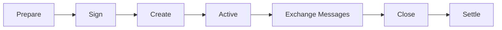
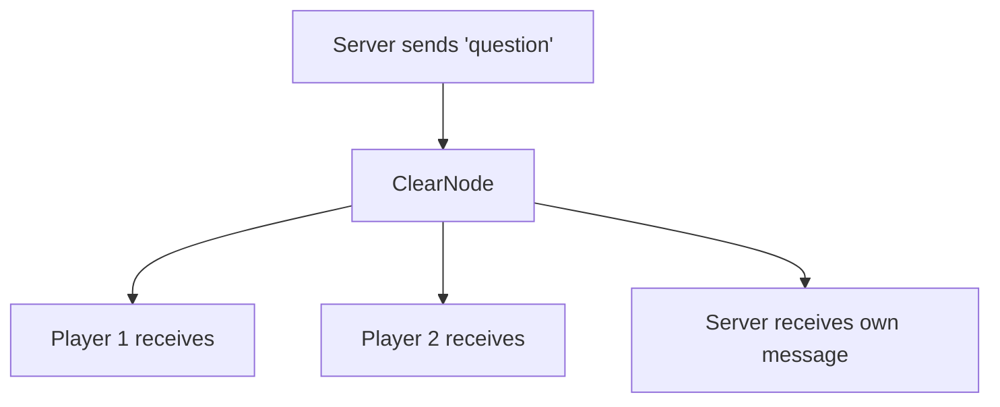

# Application Sessions

An **application session** is an isolated instance of your game, contract, or application running off-chain. Think of it like a "room" where specific participants can interact with instant, gasless transactions.

## What is a Session?

A session is:
- **A container** for application-specific state and messages
- **Multi-party** - can include 2 or more participants
- **Isolated** - sessions don't interfere with each other
- **Temporary** - created for a specific interaction, then closed
- **Off-chain** - all activity happens via the ClearNode, not on-chain

### Real-World Analogy

Think of a session like a **poker table** at a casino:
- The table has specific players (participants)
- Each player puts chips on the table (allocations)
- Players interact following game rules (message handlers)
- When the game ends, chips are distributed (final allocations)
- The casino facilitates but doesn't play (ClearNode/broker)

## Session Lifecycle



### 1. Prepare
The session initiator (usually a server) prepares the session request:

```typescript twoslash
import type { BetterNitroliteClient } from '@trivia-royale/game';
import type { Address } from 'viem';

declare const client: BetterNitroliteClient;
declare const player1: Address;
declare const player2: Address;
declare const server: Address;
// ---cut---
const request = client.prepareSession({
  participants: [player1, player2, server],
  allocations: [
    { participant: player1, asset: 'USDC', amount: '0.01' },
    { participant: player2, asset: 'USDC', amount: '0.01' },
    { participant: server, asset: 'USDC', amount: '0' },
  ],
});
```

### 2. Sign
All participants sign the request (can happen in parallel):

```typescript
const sig1 = await client1.signSessionRequest(request);
const sig2 = await client2.signSessionRequest(request);
const sigServer = await serverClient.signSessionRequest(request);
```

### 3. Create
The initiator sends all signatures to ClearNode to create the session:

```typescript twoslash
import type { BetterNitroliteClient, NitroliteRPCMessage } from '@trivia-royale/game';

declare const serverClient: BetterNitroliteClient;
declare const request: NitroliteRPCMessage;
declare const sigServer: `0x${string}`;
declare const sig1: `0x${string}`;
declare const sig2: `0x${string}`;
// ---cut---
const sessionId = await serverClient.createSession(request, [
  sigServer,  // Server signature first
  sig1,       // Then players in allocation order
  sig2,
]);
```

### 4. Active & Messaging
Participants exchange typed messages within the session:

```typescript
declare const sessionId: `0x${string}`;
// Server broadcasts a question
await serverClient.sendMessage(sessionId, 'question', {
  text: 'What is 2+2?',
  round: 1
});

// Players auto-respond via their handlers
onAppMessage: (type, sessionId, data) => {
  if (type === 'question') {
    await client.sendMessage(sessionId, 'answer', {
      answer: '4',
      from: player.address
    });
  }
}
```

### 5. Close & Settle
The initiator closes the session with final fund allocations:

```typescript twoslash
import type { BetterNitroliteClient } from '@trivia-royale/game';
import type { Address } from 'viem';

declare const serverClient: BetterNitroliteClient;
declare const sessionId: `0x${string}`;
declare const winner: Address;
declare const loser: Address;
declare const server: Address;
// ---cut---
await serverClient.closeSession(sessionId, [
//                 ^?
  { participant: winner, asset: 'USDC', amount: '0.015' },  // Winner gets 75%
  { participant: loser, asset: 'USDC', amount: '0.005' },   // Loser gets 25%
  { participant: server, asset: 'USDC', amount: '0' },
]);
```

## Session Components

### Participants
An array of Ethereum addresses that can interact in the session:

```typescript
participants: [
  '0xPlayer1Address',
  '0xPlayer2Address',
  '0xServerAddress'
]
```

**Important**: Order matters for signature collection and allocations.

### Allocations
Specifies how much each participant commits to the session:

```typescript
allocations: [
  { participant: player1, asset: 'USDC', amount: '1.00' },  // Commits 1 USDC
  { participant: player2, asset: 'USDC', amount: '1.00' },  // Commits 1 USDC
  { participant: server, asset: 'USDC', amount: '0' },      // Commits nothing
]
```

Allocations represent:
- **Entry fees** or **stakes** for games
- **Collateral** for contracts
- **Zero** for observers or facilitators (like a game server)

### Weights & Quorum
Control who can make decisions:

```typescript
const request = client.prepareSession({
  participants: [player1, player2, server],
  // Weights define voting power (must sum to quorum)
  weights: [0, 0, 100],        // Server has full control
  quorum: 100,                 // 100% needed to make decisions
  // ...
});
```

**Common patterns**:

| Pattern | Weights | Quorum | Use Case |
|---------|---------|--------|----------|
| Server-controlled | `[0, 0, 100]` | 100 | Games with server authority |
| Equal peers | `[50, 50]` | 100 | Peer-to-peer negotiations |
| Majority | `[33, 33, 34]` | 51 | Multi-party voting |

### Nonce
A unique identifier to prevent replay attacks:

```typescript
nonce: Date.now()  // Timestamp is common
```

## Common Application Patterns

Now that you understand session components, let's explore different patterns for real-world applications. The **weights and quorum** determine who controls the session and how decisions are made.

### Pattern 1: Server-Controlled Applications

**Use when**: A trusted server needs to make all decisions while players participate.

**Typical participants**: N players + 1 server/coordinator

**Configuration**:
```typescript
participants: [player1, player2, player3, server],
weights: [0, 0, 0, 100],  // Only server can make decisions
quorum: 100,              // Server has 100% voting power
```

**Real-world use cases**:
- **Trivia games**: Server asks questions, validates answers, distributes prizes
- **Casino games**: House controls game logic, players place bets
- **Matchmaking**: Coordinator pairs players and manages game sessions
- **Tournaments**: Organizer controls brackets and progression

**Example**:
```typescript twoslash
import type { BetterNitroliteClient } from '@trivia-royale/game';
import type { Address } from 'viem';

declare const serverClient: BetterNitroliteClient;
declare const player1: Address;
declare const player2: Address;
declare const player3: Address;
declare const server: Address;
// ---cut---
// Trivia game with 3 players
const request = serverClient.prepareSession({
  participants: [player1, player2, player3, server],
  allocations: [
    { participant: player1, asset: 'USDC', amount: '0.01' },
    { participant: player2, asset: 'USDC', amount: '0.01' },
    { participant: player3, asset: 'USDC', amount: '0.01' },
    { participant: server, asset: 'USDC', amount: '0' },
  ],
  // Server has full control over session outcomes
  weights: [0, 0, 0, 100],
  quorum: 100,
});
```

### Pattern 2: Escrow & Marketplace

**Use when**: Two parties transact with a neutral mediator for dispute resolution.

**Typical participants**: Buyer + Seller + Mediator

**Configuration**:
```typescript
participants: [buyer, seller, mediator],
weights: [33, 33, 34],    // Equal power, mediator breaks ties
quorum: 67,               // Requires 2 of 3 signatures
```

**Real-world use cases**:
- **E-commerce**: Buyer pays, seller delivers, mediator resolves disputes
- **Freelance platforms**: Client pays upfront, freelancer delivers work
- **P2P marketplaces**: Secure item exchanges with escrow protection
- **Service agreements**: Payment released when conditions met

**Example**:
```typescript twoslash
import type { BetterNitroliteClient } from '@trivia-royale/game';
import type { Address } from 'viem';

declare const buyerClient: BetterNitroliteClient;
declare const buyer: Address;
declare const seller: Address;
declare const mediator: Address;
// ---cut---
// Escrow for a $100 purchase
const request = buyerClient.prepareSession({
  participants: [buyer, seller, mediator],
  allocations: [
    { participant: buyer, asset: 'USDC', amount: '100' },    // Buyer pays upfront
    { participant: seller, asset: 'USDC', amount: '0' },     // Seller receives on delivery
    { participant: mediator, asset: 'USDC', amount: '0' },   // Mediator doesn't stake
  ],
  // Requires 2 of 3 to close session (e.g., buyer + seller agree, or mediator decides)
  weights: [33, 33, 34],
  quorum: 67,
});

// Later: Close with successful delivery
// await closeSession(sessionId, [
//   { participant: buyer, asset: 'USDC', amount: '0' },      // Buyer gets nothing back
//   { participant: seller, asset: 'USDC', amount: '100' },   // Seller receives payment
//   { participant: mediator, asset: 'USDC', amount: '0' },
// ]);
```

### Pattern 3: Peer-to-Peer Contracts

**Use when**: Two equal parties negotiate without a third party.

**Typical participants**: Party A + Party B

**Configuration**:
```typescript
participants: [partyA, partyB],
weights: [50, 50],        // Both parties equal
quorum: 100,              // Both must agree to close
```

**Real-world use cases**:
- **Bilateral trades**: Swap assets with mutual consent
- **Agreements**: Both parties must sign off on terms
- **Joint ventures**: Equal partners making shared decisions
- **Splitting bills**: Friends settling expenses fairly

**Example**:
```typescript twoslash
import type { BetterNitroliteClient } from '@trivia-royale/game';
import type { Address } from 'viem';

declare const aliceClient: BetterNitroliteClient;
declare const alice: Address;
declare const bob: Address;
// ---cut---
// Two friends betting on a sports game
const request = aliceClient.prepareSession({
  participants: [alice, bob],
  allocations: [
    { participant: alice, asset: 'USDC', amount: '10' },
    { participant: bob, asset: 'USDC', amount: '10' },
  ],
  // Both must agree on the outcome
  weights: [50, 50],
  quorum: 100,
});

// Later: Both agree on winner
// Requires both signatures to close
```

### Pattern 4: Multi-Player Tournaments

**Use when**: Many players compete with a coordinator managing the event.

**Typical participants**: N players (4-100+) + 1 tournament coordinator

**Configuration**:
```typescript
participants: [player1, player2, ..., playerN, coordinator],
weights: [0, 0, ..., 0, 100],  // Coordinator controls progression
quorum: 100,
```

**Real-world use cases**:
- **Battle royale**: Large player count, elimination rounds
- **Poker tournaments**: Multiple tables, blinds increase over time
- **Bracket competitions**: March Madness style eliminations
- **Leaderboard games**: Async competition with final rankings

**Example**:
```typescript twoslash
import type { BetterNitroliteClient } from '@trivia-royale/game';
import type { Address } from 'viem';

declare const coordinatorClient: BetterNitroliteClient;
declare const players: Address[];
declare const coordinator: Address;
// ---cut---
// Tournament with 16 players, $5 entry fee
const ENTRY_FEE = '5';
const NUM_PLAYERS = 16;

const request = coordinatorClient.prepareSession({
  participants: [...players, coordinator],
  allocations: [
    ...players.map(player => ({
      participant: player,
      asset: 'USDC',
      amount: ENTRY_FEE
    })),
    { participant: coordinator, asset: 'USDC', amount: '0' },
  ],
  // Coordinator controls all game progression
  weights: [...Array(NUM_PLAYERS).fill(0), 100],
  quorum: 100,
});

// Prize pool: 16 × $5 = $80
// Distribution: 1st: $40, 2nd: $24, 3rd: $16
```

### Pattern 5: Governance & Voting

**Use when**: Multiple stakeholders make decisions based on voting power.

**Typical participants**: Stakeholders with varying influence

**Configuration**:
```typescript
participants: [admin, mod1, mod2, user1, user2],
weights: [40, 20, 20, 10, 10],  // Admin has most power
quorum: 60,                      // Requires 60% consensus
```

**Real-world use cases**:
- **DAOs**: Token-weighted voting on proposals
- **Multi-sig wallets**: M-of-N signature requirements
- **Committee decisions**: Board members with different voting shares
- **Treasury management**: Stakeholder approval for spending

**Example**:
```typescript twoslash
import type { BetterNitroliteClient } from '@trivia-royale/game';
import type { Address } from 'viem';

declare const adminClient: BetterNitroliteClient;
declare const admin: Address;
declare const moderator1: Address;
declare const moderator2: Address;
declare const member1: Address;
declare const member2: Address;
// ---cut---
// DAO treasury management session
const request = adminClient.prepareSession({
  participants: [admin, moderator1, moderator2, member1, member2],
  allocations: [
    { participant: admin, asset: 'USDC', amount: '0' },
    { participant: moderator1, asset: 'USDC', amount: '0' },
    { participant: moderator2, asset: 'USDC', amount: '0' },
    { participant: member1, asset: 'USDC', amount: '0' },
    { participant: member2, asset: 'USDC', amount: '0' },
  ],
  // Admin: 40%, Mods: 20% each, Members: 10% each
  weights: [40, 20, 20, 10, 10],
  // Need 60% to pass (e.g., admin + one mod, or all 3 mods + 1 member)
  quorum: 60,
});

// Examples of valid signatures to close:
// - Admin (40%) + Mod1 (20%) = 60% ✓
// - Mod1 (20%) + Mod2 (20%) + Member1 (10%) + Member2 (10%) = 60% ✓
// - Admin (40%) alone = 40% ✗
```

### Choosing the Right Pattern

| Pattern | Control Model | Typical Participants | Best For |
|---------|---------------|----------------------|----------|
| Server-Controlled | Centralized | Players + Server | Games, competitions, matchmaking |
| Escrow | Mediated | Buyer + Seller + Mediator | Marketplaces, freelancing, trades |
| Peer-to-Peer | Equal | 2 parties | Bets, swaps, bilateral agreements |
| Tournament | Centralized | Many players + Coordinator | Large competitions, brackets |
| Governance | Weighted voting | Multiple stakeholders | DAOs, multi-sig, committees |

**Pro tip**: You can combine patterns! For example:
- Escrow with governance (community votes on disputes)
- Tournament with peer-to-peer (players negotiate side bets)
- Server-controlled with governance (players vote on rule changes)

## Session IDs

When a session is created, you receive a unique session ID:

```typescript
const sessionId = await client.createSession(request, signatures);
// sessionId: "0x8f3b2c1d..."
```

This ID is used for all subsequent operations:
- Sending messages: `client.sendMessage(sessionId, ...)`
- Closing the session: `client.closeSession(sessionId, ...)`
- Tracking active sessions: `client.getActiveSessions()` → includes this ID

## Active Session Management

The `BetterNitroliteClient` automatically tracks active sessions:

```typescript twoslash
import type { BetterNitroliteClient } from '@trivia-royale/game';
import type { Address } from "viem";

declare const client: BetterNitroliteClient;
declare const sessionId: `0x${string}`;
declare const finalAllocations: {
      participant: Address;
      asset: string;
      amount: string;
    }[];
// ---cut---
// After creating or joining
const activeSessions = client.getActiveSessions();
//    ^?
// → ['0x8f3b2c1d...', '0x7a2b3c4d...']


// After closing
await client.closeSession(sessionId, finalAllocations);
//           ^?
// → Session removed from active list
```

## Message Broadcasting

When you send a message to a session, it broadcasts to **all participants**:



**Important**: You also receive your own messages! Filter in your handler:

```typescript
onAppMessage: (type, sessionId, data) => {
  // Server sent 'start_game', all players receive it
  if (type === 'start_game') {
    console.log('Game started!');
  }

  // Players send 'answer', server wants to collect them
  if (type === 'answer') {
    // Make sure we're not processing our own answer
    if (data.from !== myAddress) {
      collectAnswer(data);
    }
  }
}
```

## Session Allowances

When connecting to ClearNode, you can specify a **session allowance** - the maximum amount you're willing to commit to any single session:

```typescript
const client = createBetterNitroliteClient({
  wallet,
  sessionAllowance: '0.01',  // Max 0.01 USDC per session
  // ...
});
```

This prevents:
- Accidentally joining expensive sessions
- Malicious sessions draining your channel
- Overspending in games

When someone tries to create a session with you requiring more than your allowance, you won't auto-join.

## Session Closure & Settlement

When closing a session, you must specify **final allocations** for all participants:

```typescript
await client.closeSession(sessionId, [
  { participant: winner, asset: 'USDC', amount: '1.80' },   // Winner gets 90%
  { participant: loser, asset: 'USDC', amount: '0.20' },    // Loser gets 10%
  { participant: server, asset: 'USDC', amount: '0' },
]);
```

**Critical**: The sum of final allocations should equal the sum of initial allocations (fund conservation):

```typescript
// Initial allocations
// player1: 1.00, player2: 1.00, server: 0 → Total: 2.00

// Final allocations must also sum to 2.00
// winner: 1.80, loser: 0.20, server: 0 → Total: 2.00 ✓
```

After closure:
- Funds are returned to participants' **ledger balances**
- Session is removed from active session list
- No more messages can be sent to this session

## Example: Complete Session Flow

```typescript twoslash
import { createBetterNitroliteClient } from '@trivia-royale/game';
import type { BetterNitroliteClient, Wallet } from '@trivia-royale/game';
import type { Address } from 'viem';

declare const serverWallet: Wallet;
declare const player1Client: BetterNitroliteClient;
declare const player2Client: BetterNitroliteClient;
declare const player1: { address: Address };
declare const player2: { address: Address };
// ---cut---
// Server creates a simple 2-player game
const server = createBetterNitroliteClient({ wallet: serverWallet });
await server.connect();

// 1. Prepare session
const request = server.prepareSession({
//    ^?
  participants: [player1.address, player2.address, serverWallet.address],
  allocations: [
    { participant: player1.address, asset: 'USDC', amount: '1' },
    { participant: player2.address, asset: 'USDC', amount: '1' },
    { participant: serverWallet.address, asset: 'USDC', amount: '0' },
  ],
});

// 2. Collect signatures (in real app, via HTTP/WebSocket)
const [sig1, sig2, sigServer] = await Promise.all([
  player1Client.signSessionRequest(request),
  player2Client.signSessionRequest(request),
  server.signSessionRequest(request),
]);

// 3. Create session
const sessionId = await server.createSession(request, [sigServer, sig1, sig2]);
//    ^?

// 4. Play the game
await server.sendMessage(sessionId, 'start', { timestamp: Date.now() });
//           ^?
// ... game logic happens via message handlers ...

// 5. Close with results
await server.closeSession(sessionId, [
//           ^?
  { participant: player1.address, asset: 'USDC', amount: '1.5' },  // Player 1 won
  { participant: player2.address, asset: 'USDC', amount: '0.5' },  // Player 2 lost
  { participant: serverWallet.address, asset: 'USDC', amount: '0' },
]);

console.log('Session closed, prizes distributed to ledger balances');
```

## Next Steps

Now that you understand sessions:
- **[Message Flow](./message-flow)**: Learn how messages are broadcast and handled
- **[Distributed Sessions](../building-blocks/distributed-sessions)**: Deep dive into the signature coordination pattern
- **[Ping-Pong Example](../patterns/ping-pong)**: Build your first session
- **[Complete Game](../patterns/complete-game)**: See sessions in a real multiplayer game
