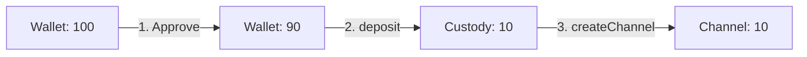
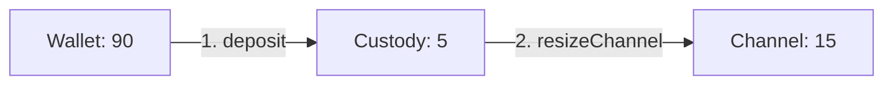
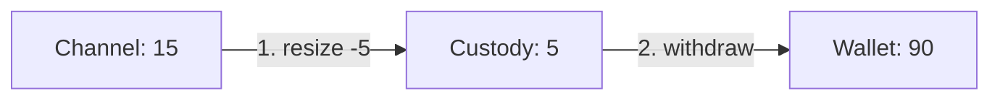
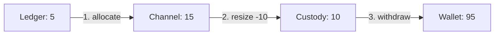
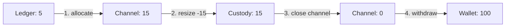

# Fund Management

Fund management is one of the most important - and initially confusing - aspects of Yellow SDK. This guide walks through every operation with diagrams, code examples, and balance checks at each step.

## Overview

Fund management involves moving value through the 4-layer balance system:

```
WALLET ←→ CUSTODY ←→ CHANNEL ←→ LEDGER
```

The `BetterNitroliteClient` provides three high-level methods:
- **`deposit(amount)`** - Move funds from wallet into the channel
- **`withdraw(amount)`** - Move funds from channel back to wallet
- **`send({ to, amount })`** - Transfer value via ledger (peer-to-peer)

Under the hood, these use low-level resize and allocate operations.

## Deposit Flow

### First Deposit (No Channel Exists)

When you have no channel, `deposit()` creates one:

```typescript
// Starting state
const before = await client.getBalances();
// { wallet: 100, custody: 0, channel: 0, ledger: 0 }

await client.deposit(parseUSDC('10'));

const after = await client.getBalances();
// { wallet: 90, custody: 0, channel: 10, ledger: 0 }
```

**What happened**:



1. **Approve**: ERC-20 approval for custody contract to spend USDC
2. **Deposit**: Transfer from wallet → custody contract
3. **Create Channel**: On-chain transaction creates channel, moves custody → channel

### Subsequent Deposits (Channel Exists)

When you already have a channel, `deposit()` resizes it:

```typescript
// Starting state (channel exists)
const before = await client.getBalances();
// { wallet: 90, custody: 0, channel: 10, ledger: 0 }

await client.deposit(parseUSDC('5'));

const after = await client.getBalances();
// { wallet: 85, custody: 0, channel: 15, ledger: 0 }
```

**What happened**:



1. **Deposit**: Transfer from wallet → custody (5 USDC)
2. **Resize**: Channel resized +5 (from 10 to 15), custody drained back to 0

## Withdrawal Flow

Withdrawal is more complex because it must handle **ledger**, **channel**, and **custody** balances.

### Simple Withdrawal (No Ledger Balance)

```typescript
const before = await client.getBalances();
// { wallet: 85, custody: 0, channel: 15, ledger: 0 }

await client.withdraw(parseUSDC('5'));

const after = await client.getBalances();
// { wallet: 90, custody: 0, channel: 10, ledger: 0 }
```

**What happened**:



1. **Resize**: Channel reduced by 5 (15 → 10), custody increased by 5 (0 → 5)
2. **Withdraw**: Custody transferred to wallet (5), custody back to 0

### Complex Withdrawal (With Ledger Balance)

When you have a ledger balance, it must be deallocated first:

```typescript
const before = await client.getBalances();
// { wallet: 85, custody: 0, channel: 10, ledger: 5 }
// Note: Total available = 10 + 5 = 15 USDC

await client.withdraw(parseUSDC('10'));

const after = await client.getBalances();
// { wallet: 95, custody: 0, channel: 5, ledger: 0 }
```

**What happened**:



1. **Allocate**: Ledger balance moved to channel (ledger 5 → 0, channel 10 → 15)
2. **Resize**: Channel reduced by 10 (15 → 5), custody increased (0 → 10)
3. **Withdraw**: Custody to wallet (10 USDC)

### Total Withdrawal (Draining Everything)

When withdrawing all funds, the channel is closed:

```typescript
const before = await client.getBalances();
// { wallet: 85, custody: 0, channel: 10, ledger: 5 }

const total = before.channel + before.ledger + before.custodyContract;
// total = 15 USDC

await client.withdraw(total);

const after = await client.getBalances();
// { wallet: 100, custody: 0, channel: 0, ledger: 0 }
```

**What happened**:



1. **Allocate**: Ledger → channel
2. **Resize**: Channel fully drained → custody
3. **Close**: Empty channel closed (on-chain transaction)
4. **Withdraw**: Custody → wallet

## Resize Operations

Resize operations move funds between **custody** and **channel**.

### Understanding resize_amount

The `resize_amount` parameter controls custody ↔ channel movement:

```typescript
// Positive resize_amount: custody → channel (add funds)
resize_amount: 5n  // Add 5 to channel from custody

// Negative resize_amount: channel → custody (remove funds)
resize_amount: -5n // Remove 5 from channel to custody
```

### Understanding allocate_amount

The `allocate_amount` parameter controls channel ↔ ledger movement:

```typescript
// Negative allocate_amount: ledger → channel (deallocate)
allocate_amount: -5n  // Move 5 from ledger back to channel

// Positive allocate_amount: channel → ledger (allocate)
allocate_amount: 5n   // Move 5 from channel to ledger
```

### Example: Adding Funds with Existing Custody Balance

```typescript
const before = await client.getBalances();
// { wallet: 90, custody: 3, channel: 10, ledger: 0 }
// Note: We have leftover custody balance from previous operations

// We want to add the 3 USDC in custody to our channel
await client.deposit(0n); // Deposit 0 from wallet, but use custody funds

const after = await client.getBalances();
// { wallet: 90, custody: 0, channel: 13, ledger: 0 }
```

Actually, let's correct this - you'd call:

```typescript
// The deposit() method automatically uses custody funds if available
await client.deposit(parseUSDC('7'));
// This will:
// 1. Use 3 USDC from custody
// 2. Pull 4 USDC from wallet → custody
// 3. Resize channel +7

const after = await client.getBalances();
// { wallet: 86, custody: 0, channel: 17, ledger: 0 }
```

### Example: Draining Ledger to Channel

When you have a negative ledger balance (you sent money):

```typescript
const before = await client.getBalances();
// { wallet: 85, custody: 0, channel: 10, ledger: -3 }
// Note: Negative ledger means you owe 3 to the channel

// To withdraw, must first deallocate ledger → channel
// This happens automatically in withdraw(), but manually:
await resizeChannelWithAmounts(channelId, 0n, -3n);
// allocate_amount: -3 → move ledger balance into channel

const after = await client.getBalances();
// { wallet: 85, custody: 0, channel: 7, ledger: 0 }
// Note: Channel reduced from 10 to 7 because ledger debt was settled
```

## Proof States

When resizing channels, you may need **proof states** - cryptographic proofs of previous channel states.

### Why Proof States Exist

State channels work by updating signed state off-chain. When you want to resize on-chain, you need to prove the current state is valid:

```
State v1 → State v2 → State v3 → Current State
  ↑         ↑         ↑             ↑
Proof     Proof     Proof    Want to resize here!
```

The channel needs a "chain of custody" showing how it got to the current state.

### How BetterNitroliteClient Handles Them

The `BetterNitroliteClient` automatically manages proof states via `StateStorage`:

```typescript
// Internal: After each successful resize
const channelData = await client.getChannelData(channelId);
await stateStorage.appendChannelState(channelId, channelData.lastValidState);

// When next resize happens
const proofStates = await stateStorage.getChannelState(channelId);
await client.resizeChannel({
  resizeState: newState,
  proofStates: proofStates, // ← Proves state chain
});
```

You don't need to manage this manually when using `deposit()` and `withdraw()`.

### Clearing Proof States

After a successful on-chain resize, previous proofs become obsolete:

```typescript
// After successful resize transaction
await stateStorage.appendChannelState(channelId, newOnChainState);
// Old proof states are now safely stored on-chain
```

## Peer-to-Peer Payments

The `send()` method transfers value via **ledger balances**:

```typescript
const before = await client.getBalances();
// { wallet: 90, custody: 0, channel: 10, ledger: 0 }

await client.send({ to: recipientAddress, amount: parseUSDC('3') });

const after = await client.getBalances();
// { wallet: 90, custody: 0, channel: 10, ledger: -3 }
//                                              ↑ negative!
```

**Key insight**: Ledger balances are **net positions**:
- Sending decreases your ledger (can go negative)
- Receiving increases your ledger (can go positive)
- Your channel capacity backs negative balances

### Recipient's Perspective

```typescript
// Before (recipient)
const before = await recipientClient.getBalances();
// { wallet: 50, custody: 0, channel: 5, ledger: 0 }

// After sender.send() completes
const after = await recipientClient.getBalances();
// { wallet: 50, custody: 0, channel: 5, ledger: 3 }
//                                             ↑ increased!
```

The recipient's ledger balance increased by 3 USDC, backed by the sender's channel.

## Checking Available Balance

Always check total available before operations:

```typescript
const balances = await client.getBalances();

const totalAvailable =
  balances.wallet +           // Can deposit from here
  balances.custodyContract +  // Already in escrow
  balances.channel +          // In channel
  balances.ledger;            // Off-chain balance (can be negative!)

console.log(`Total funds: ${formatUSDC(totalAvailable)}`);
```

For withdrawals, exclude wallet:

```typescript
const totalWithdrawable =
  balances.custodyContract +
  balances.channel +
  balances.ledger;

if (totalWithdrawable > 0) {
  await client.withdraw(totalWithdrawable);
}
```

## Error Handling

### Insufficient Wallet Balance

```typescript
try {
  await client.deposit(parseUSDC('1000'));
} catch (error) {
  // Error: Insufficient funds. Need 1000.00 USDC, have 100.00 USDC
  console.error(error.message);
}
```

### Insufficient Channel Capacity

```typescript
try {
  await client.send({ to: recipient, amount: parseUSDC('50') });
} catch (error) {
  // Error: Would exceed channel capacity
  // Current capacity: 10 USDC, ledger: -5, requested: 50
  console.error(error.message);
}
```

### Not Connected to ClearNode

```typescript
try {
  await client.withdraw(parseUSDC('5'));
} catch (error) {
  // Error: Not connected to ClearNode
  console.error('Please connect first');
  await client.connect();
}
```

## Best Practices

### 1. Always Check Balances First

```typescript
const balances = await client.getBalances();
console.log('Before operation:', {
  wallet: formatUSDC(balances.wallet),
  channel: formatUSDC(balances.channel),
  ledger: formatUSDC(balances.ledger),
});

await client.deposit(parseUSDC('10'));

const after = await client.getBalances();
console.log('After operation:', {
  wallet: formatUSDC(after.wallet),
  channel: formatUSDC(after.channel),
  ledger: formatUSDC(after.ledger),
});
```

### 2. Handle Partial Failures

```typescript
try {
  await client.withdraw(totalAvailable);
} catch (error) {
  // Withdrawal might partially succeed (e.g., ledger deallocated but custody withdrawal failed)
  // Always re-check balances after errors
  const balances = await client.getBalances();
  console.log('Current state after error:', balances);
}
```

### 3. Wait for State to Settle

After deposits/withdrawals, give state time to propagate:

```typescript
await client.deposit(parseUSDC('10'));

// Wait a moment before checking balances
await new Promise(resolve => setTimeout(resolve, 1000));

const balances = await client.getBalances();
```

### 4. Keep Channel Funded

Maintain enough channel capacity for expected activity:

```typescript
const MIN_CHANNEL_BALANCE = parseUSDC('10');

const balances = await client.getBalances();
if (balances.channel < MIN_CHANNEL_BALANCE) {
  const needed = MIN_CHANNEL_BALANCE - balances.channel;
  await client.deposit(needed);
}
```

## Complete Example

Here's a complete flow from start to finish:

```typescript
import { createBetterNitroliteClient } from './client';
import { parseUSDC, formatUSDC } from './core/erc20';

async function completeFlow() {
  const client = createBetterNitroliteClient({ wallet });
  await client.connect();

  console.log('=== Initial State ===');
  let balances = await client.getBalances();
  console.log(`Wallet: ${formatUSDC(balances.wallet)}`);
  console.log(`Channel: ${formatUSDC(balances.channel)}`);
  console.log(`Ledger: ${formatUSDC(balances.ledger)}`);

  console.log('\n=== Depositing 10 USDC ===');
  await client.deposit(parseUSDC('10'));
  balances = await client.getBalances();
  console.log(`Channel: ${formatUSDC(balances.channel)}`);

  console.log('\n=== Sending 3 USDC ===');
  await client.send({ to: recipientAddress, amount: parseUSDC('3') });
  balances = await client.getBalances();
  console.log(`Ledger: ${formatUSDC(balances.ledger)}`);

  console.log('\n=== Withdrawing All ===');
  const total = balances.channel + balances.ledger + balances.custodyContract;
  await client.withdraw(total);
  balances = await client.getBalances();
  console.log(`Wallet: ${formatUSDC(balances.wallet)}`);
  console.log(`Channel: ${formatUSDC(balances.channel)}`);
  console.log(`Ledger: ${formatUSDC(balances.ledger)}`);

  await client.disconnect();
}
```

## Next Steps

- **[Distributed Sessions](./distributed-sessions)**: Coordinate multi-party session creation
- **[Simple Payment Pattern](../patterns/simple-payment)**: See fund management in action
- **[Complete Game](../patterns/complete-game)**: Fund flows in a real application
