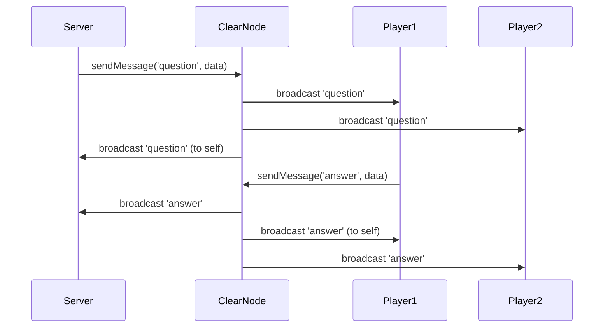

# Message Flow

In Yellow SDK applications, all real-time communication happens through the **ClearNode** - a message broker that routes messages between participants. Understanding this architecture is key to building responsive applications.

## Architecture Overview

```
┌─────────────┐         ┌─────────────┐         ┌─────────────┐
│  Client A   │←───────→│  ClearNode  │←───────→│  Client B   │
│  (Player)   │  WebSocket   (Broker)    WebSocket  (Player)   │
└─────────────┘         └─────────────┘         └─────────────┘
                              ↕
                        ┌─────────────┐
                        │  Client C   │
                        │  (Server)   │
                        └─────────────┘
```

**Key points**:
- Clients never communicate directly with each other
- All messages flow through the ClearNode
- ClearNode broadcasts messages to all session participants
- Messages are **asynchronous** and **event-driven**

## Message Types

There are two categories of messages:

### 1. System Messages (ClearNode ↔ Client)
Protocol-level messages for connection management:
- `auth_request`, `auth_challenge`, `auth_verify` - Authentication flow
- `get_channels`, `get_balances` - Querying state
- `resize_channel`, `close_channel` - Channel operations

### 2. Application Messages (Client ↔ Client via ClearNode)
Your custom message types defined in the message schema:
- `question`, `answer`, `result` - Trivia game messages
- `move`, `game_over` - Chess game messages
- `offer`, `accept`, `reject` - Marketplace messages
- Any types you define!

## Application Message Flow

Let's trace a message through the system:



**Important observations**:
1. Messages are broadcast to **all participants** (including sender)
2. Messages arrive **asynchronously**
3. Order is preserved per-sender, but not globally
4. You must filter your own messages in handlers

## Defining Message Schemas

Use TypeScript interfaces to define your application's message types:

```typescript
import { MessageSchema } from './client';
import type { Address } from 'viem';

interface TriviaGameSchema extends MessageSchema {
  // Each key is a message type
  game_start: {
    data: {
      totalRounds: number;
      entryFee: string;
    };
  };

  question: {
    data: {
      text: string;
      round: number;
    };
  };

  answer: {
    data: {
      answer: string;
      round: number;
      from: Address;
      timestamp: number;
    };
  };

  round_result: {
    data: {
      winner: Address;
      correctAnswer: string;
      round: number;
    };
  };

  game_over: {
    data: {
      finalWinner: Address;
      scores: Record<string, number>;
    };
  };
}
```

**Benefits of typed schemas**:
- TypeScript autocomplete for message data
- Compile-time type checking
- Self-documenting message format
- Prevents typos in message types

## Handling Messages

Use the `onAppMessage` handler to receive messages:

```typescript
const client = createBetterNitroliteClient<TriviaGameSchema>({
  wallet,
  onAppMessage: async (type, sessionId, data) => {
    // type is: 'game_start' | 'question' | 'answer' | 'round_result' | 'game_over'
    // data is typed based on the message type!

    switch (type) {
      case 'question':
        // data.text is typed as string
        // data.round is typed as number
        console.log(`Question ${data.round}: ${data.text}`);

        // Respond with answer
        await client.sendMessage(sessionId, 'answer', {
          answer: getAnswer(data.text),
          round: data.round,
          from: wallet.address,
          timestamp: Date.now(),
        });
        break;

      case 'round_result':
        if (data.winner === wallet.address) {
          console.log(`I won round ${data.round}!`);
        }
        break;

      // ... handle other message types
    }
  },
});
```

## Sending Messages

Use `sendMessage()` to broadcast to all session participants:

```typescript
await client.sendMessage(sessionId, 'question', {
  text: 'What is 2+2?',
  round: 1,
});
```

This message will be received by:
- All other participants in the session
- Yourself (in your own `onAppMessage` handler)

## Filtering Your Own Messages

Since you receive your own messages, you often need to filter them:

```typescript
onAppMessage: async (type, sessionId, data) => {
  if (type === 'answer') {
    // Only process answers from OTHER players
    if (data.from !== wallet.address) {
      recordAnswer(data.answer);
    }
  }

  // But sometimes you DO want your own messages
  if (type === 'game_start') {
    // All players (including sender) should initialize
    initializeGame(data);
  }
}
```

**Rule of thumb**:
- **Filter out** your own messages when collecting responses (answers, moves, etc.)
- **Include** your own messages when everyone should react the same way (game_start, etc.)

## Message Ordering

Messages from a single sender are delivered **in order**:

```typescript
// Server sends three messages
await server.sendMessage(sessionId, 'question', { round: 1, ... });
await server.sendMessage(sessionId, 'question', { round: 2, ... });
await server.sendMessage(sessionId, 'question', { round: 3, ... });

// Players receive them in order: round 1, then 2, then 3 ✓
```

But messages from **different senders** may arrive in any order:

```typescript
// Player 1 sends answer (at 10:00:00.100)
await player1.sendMessage(sessionId, 'answer', { ... });

// Player 2 sends answer (at 10:00:00.080)
await player2.sendMessage(sessionId, 'answer', { ... });

// Server might receive Player 2's answer first!
// Even though Player 1 sent theirs earlier
```

**Solution**: Include timestamps in messages when ordering matters:

```typescript
answer: {
  data: {
    answer: string;
    timestamp: number;  // Add this!
  };
}

// Then sort by timestamp
const sortedAnswers = answers.sort((a, b) => a.timestamp - b.timestamp);
```

## Auto-Joining Sessions

The `BetterNitroliteClient` automatically joins sessions when you receive your first message:

```typescript
// You haven't explicitly joined any sessions
const sessions = client.getActiveSessions();
// → []

// Someone sends you a message in session "0xabc123..."
// Your handler is called:
onAppMessage: (type, sessionId, data) => {
  console.log(`Received ${type} in ${sessionId}`);
}

// Now the session is tracked as active
const sessionsAfter = client.getActiveSessions();
// → ['0xabc123...']
```

This enables:
- Receiving invites to sessions you didn't create
- Joining games without explicit join flow
- Simplifying client code

## Session Close Notifications

When a session is closed, all participants are notified:

```typescript
const client = createBetterNitroliteClient({
  wallet,
  onSessionClosed: (sessionId, finalAllocations) => {
    console.log(`Session ${sessionId} closed`);
    console.log('Final allocations:', finalAllocations);

    // Clean up any session-specific state
    cleanupGame(sessionId);
  },
});
```

**Note**: Currently ClearNode only notifies the requester (whoever called `closeSession`). Other participants may not receive the notification, so design your application to handle this:

```typescript
// Server closes session
await server.closeSession(sessionId, finalAllocations);

// Then explicitly notifies players via a message
await server.sendMessage(sessionId, 'game_over', {
  finalAllocations,
});

// Players handle the game_over message to clean up
onAppMessage: (type, sessionId, data) => {
  if (type === 'game_over') {
    // Remove from active sessions manually
    cleanupGame(sessionId);
  }
}
```

## Message Handler Patterns

### Pattern 1: Immediate Response

Respond directly in the handler:

```typescript
onAppMessage: async (type, sessionId, data) => {
  if (type === 'ping') {
    // Immediately respond with pong
    await client.sendMessage(sessionId, 'pong', {
      timestamp: Date.now(),
    });
  }
}
```

### Pattern 2: Delayed Response

Schedule response with a delay:

```typescript
onAppMessage: async (type, sessionId, data) => {
  if (type === 'question') {
    // Simulate thinking time
    setTimeout(async () => {
      await client.sendMessage(sessionId, 'answer', {
        answer: computeAnswer(data.text),
      });
    }, 1000);  // Answer after 1 second
  }
}
```

### Pattern 3: State Accumulation

Collect messages and process later:

```typescript
const answers = new Map();

onAppMessage: async (type, sessionId, data) => {
  if (type === 'answer') {
    // Collect all answers
    answers.set(data.from, data.answer);

    // When all players answered
    if (answers.size === numPlayers) {
      const winner = determineWinner(answers);
      await client.sendMessage(sessionId, 'round_result', { winner });
    }
  }
}
```

### Pattern 4: Event Forwarding

Forward messages to other parts of your app:

```typescript
import { EventEmitter } from 'events';
const gameEvents = new EventEmitter();

onAppMessage: async (type, sessionId, data) => {
  // Emit to your app's event system
  gameEvents.emit(type, { sessionId, data });
}

// Elsewhere in your app
gameEvents.on('question', ({ sessionId, data }) => {
  updateUI(data.text);
});
```

## Error Handling

Handle message sending failures gracefully:

```typescript
try {
  await client.sendMessage(sessionId, 'move', { x: 5, y: 3 });
} catch (error) {
  if (error.message.includes('not active')) {
    console.error('Session was closed');
    // Navigate user away from game
  } else if (error.message.includes('not connected')) {
    console.error('Lost connection to ClearNode');
    // Show reconnection UI
  } else {
    console.error('Failed to send message:', error);
  }
}
```

## Best Practices

### 1. Always Include Sender Address

When multiple participants send the same message type:

```typescript
answer: {
  data: {
    answer: string;
    from: Address;  // ← Always include this!
  };
}
```

### 2. Add Timestamps for Ordering

When timing matters:

```typescript
move: {
  data: {
    x: number;
    y: number;
    timestamp: number;  // ← Enables sorting
  };
}
```

### 3. Version Your Messages

For evolving schemas:

```typescript
game_state: {
  data: {
    version: 1;  // ← Enables backward compatibility
    // ... rest of data
  };
}
```

### 4. Keep Messages Small

Messages are sent over WebSocket - keep them lean:

```typescript
// ✗ Bad: Sending entire game state
await client.sendMessage(sessionId, 'update', {
  fullGameState: hugeObject,  // Slow!
});

// ✓ Good: Send only the change
await client.sendMessage(sessionId, 'move', {
  playerId: player,
  position: { x: 5, y: 3 },  // Fast!
});
```

## Next Steps

Now that you understand message flow:
- **[Typed Messaging](../building-blocks/typed-messaging)**: Deep dive into message schema patterns
- **[Ping-Pong Example](../patterns/ping-pong)**: Build a simple message-driven app
- **[Complete Game](../patterns/complete-game)**: See complex message flows in action
