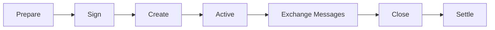
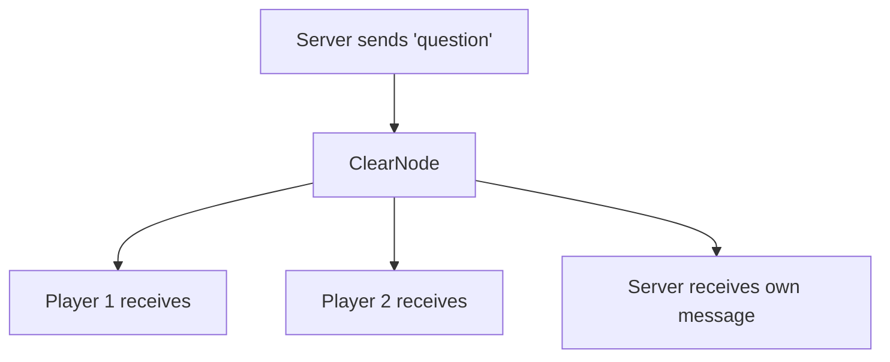

# Application Sessions

An **application session** is an isolated instance of your game, contract, or application running off-chain. Think of it like a "room" where specific participants can interact with instant, gasless transactions.

## What is a Session?

A session is:
- **A container** for application-specific state and messages
- **Multi-party** - can include 2 or more participants
- **Isolated** - sessions don't interfere with each other
- **Temporary** - created for a specific interaction, then closed
- **Off-chain** - all activity happens via the ClearNode, not on-chain

### Real-World Analogy

Think of a session like a **poker table** at a casino:
- The table has specific players (participants)
- Each player puts chips on the table (allocations)
- Players interact following game rules (message handlers)
- When the game ends, chips are distributed (final allocations)
- The casino facilitates but doesn't play (ClearNode/broker)

## Session Lifecycle



### 1. Prepare
The session initiator (usually a server) prepares the session request:

```typescript
const request = client.prepareSession({
  participants: [player1, player2, server],
  allocations: [
    { participant: player1, asset: 'USDC', amount: '0.01' },
    { participant: player2, asset: 'USDC', amount: '0.01' },
    { participant: server, asset: 'USDC', amount: '0' },
  ],
});
```

### 2. Sign
All participants sign the request (can happen in parallel):

```typescript
const sig1 = await client1.signSessionRequest(request);
const sig2 = await client2.signSessionRequest(request);
const sigServer = await serverClient.signSessionRequest(request);
```

### 3. Create
The initiator sends all signatures to ClearNode to create the session:

```typescript
const sessionId = await serverClient.createSession(request, [
  sigServer,  // Server signature first
  sig1,       // Then players in allocation order
  sig2,
]);
```

### 4. Active & Messaging
Participants exchange typed messages within the session:

```typescript
// Server broadcasts a question
await serverClient.sendMessage(sessionId, 'question', {
  text: 'What is 2+2?',
  round: 1
});

// Players auto-respond via their handlers
onAppMessage: (type, sessionId, data) => {
  if (type === 'question') {
    await client.sendMessage(sessionId, 'answer', {
      answer: '4',
      from: player.address
    });
  }
}
```

### 5. Close & Settle
The initiator closes the session with final fund allocations:

```typescript
await serverClient.closeSession(sessionId, [
  { participant: winner, asset: 'USDC', amount: '0.015' },  // Winner gets 75%
  { participant: loser, asset: 'USDC', amount: '0.005' },   // Loser gets 25%
  { participant: server, asset: 'USDC', amount: '0' },
]);
```

## Session Components

### Participants
An array of Ethereum addresses that can interact in the session:

```typescript
participants: [
  '0xPlayer1Address',
  '0xPlayer2Address',
  '0xServerAddress'
]
```

**Important**: Order matters for signature collection and allocations.

### Allocations
Specifies how much each participant commits to the session:

```typescript
allocations: [
  { participant: player1, asset: 'USDC', amount: '1.00' },  // Commits 1 USDC
  { participant: player2, asset: 'USDC', amount: '1.00' },  // Commits 1 USDC
  { participant: server, asset: 'USDC', amount: '0' },      // Commits nothing
]
```

Allocations represent:
- **Entry fees** or **stakes** for games
- **Collateral** for contracts
- **Zero** for observers or facilitators (like a game server)

### Weights & Quorum
Control who can make decisions:

```typescript
const request = client.prepareSession({
  participants: [player1, player2, server],
  // Weights define voting power (must sum to quorum)
  weights: [0, 0, 100],        // Server has full control
  quorum: 100,                 // 100% needed to make decisions
  // ...
});
```

**Common patterns**:

| Pattern | Weights | Quorum | Use Case |
|---------|---------|--------|----------|
| Server-controlled | `[0, 0, 100]` | 100 | Games with server authority |
| Equal peers | `[50, 50]` | 100 | Peer-to-peer negotiations |
| Majority | `[33, 33, 34]` | 51 | Multi-party voting |

### Nonce
A unique identifier to prevent replay attacks:

```typescript
nonce: Date.now()  // Timestamp is common
```

## Session IDs

When a session is created, you receive a unique session ID:

```typescript
const sessionId = await client.createSession(request, signatures);
// sessionId: "0x8f3b2c1d..."
```

This ID is used for all subsequent operations:
- Sending messages: `client.sendMessage(sessionId, ...)`
- Closing the session: `client.closeSession(sessionId, ...)`
- Tracking active sessions: `client.getActiveSessions()` → includes this ID

## Active Session Management

The `BetterNitroliteClient` automatically tracks active sessions:

```typescript
// After creating or joining
const activeSessions = client.getActiveSessions();
// → ['0x8f3b2c1d...', '0x7a2b3c4d...']

// Auto-join when receiving first message
onAppMessage: (type, sessionId, data) => {
  // ClearNode sent you a message in this session
  // → Session automatically added to active list
}

// After closing
await client.closeSession(sessionId, finalAllocations);
// → Session removed from active list
```

## Message Broadcasting

When you send a message to a session, it broadcasts to **all participants**:



**Important**: You also receive your own messages! Filter in your handler:

```typescript
onAppMessage: (type, sessionId, data) => {
  // Server sent 'start_game', all players receive it
  if (type === 'start_game') {
    console.log('Game started!');
  }

  // Players send 'answer', server wants to collect them
  if (type === 'answer') {
    // Make sure we're not processing our own answer
    if (data.from !== myAddress) {
      collectAnswer(data);
    }
  }
}
```

## Session Allowances

When connecting to ClearNode, you can specify a **session allowance** - the maximum amount you're willing to commit to any single session:

```typescript
const client = createBetterNitroliteClient({
  wallet,
  sessionAllowance: '0.01',  // Max 0.01 USDC per session
  // ...
});
```

This prevents:
- Accidentally joining expensive sessions
- Malicious sessions draining your channel
- Overspending in games

When someone tries to create a session with you requiring more than your allowance, you won't auto-join.

## Session Closure & Settlement

When closing a session, you must specify **final allocations** for all participants:

```typescript
await client.closeSession(sessionId, [
  { participant: winner, asset: 'USDC', amount: '1.80' },   // Winner gets 90%
  { participant: loser, asset: 'USDC', amount: '0.20' },    // Loser gets 10%
  { participant: server, asset: 'USDC', amount: '0' },
]);
```

**Critical**: The sum of final allocations should equal the sum of initial allocations (fund conservation):

```typescript
// Initial allocations
// player1: 1.00, player2: 1.00, server: 0 → Total: 2.00

// Final allocations must also sum to 2.00
// winner: 1.80, loser: 0.20, server: 0 → Total: 2.00 ✓
```

After closure:
- Funds are returned to participants' **ledger balances**
- Session is removed from active session list
- No more messages can be sent to this session

## Example: Complete Session Flow

```typescript
// Server creates a simple 2-player game
const server = createBetterNitroliteClient({ wallet: serverWallet });
await server.connect();

// 1. Prepare session
const request = server.prepareSession({
  participants: [player1.address, player2.address, server.address],
  allocations: [
    { participant: player1.address, asset: 'USDC', amount: '1' },
    { participant: player2.address, asset: 'USDC', amount: '1' },
    { participant: server.address, asset: 'USDC', amount: '0' },
  ],
});

// 2. Collect signatures (in real app, via HTTP/WebSocket)
const [sig1, sig2, sigServer] = await Promise.all([
  player1Client.signSessionRequest(request),
  player2Client.signSessionRequest(request),
  server.signSessionRequest(request),
]);

// 3. Create session
const sessionId = await server.createSession(request, [sigServer, sig1, sig2]);
console.log(`Session created: ${sessionId}`);

// 4. Play the game
await server.sendMessage(sessionId, 'start', { timestamp: Date.now() });
// ... game logic happens via message handlers ...

// 5. Close with results
await server.closeSession(sessionId, [
  { participant: player1.address, asset: 'USDC', amount: '1.5' },  // Player 1 won
  { participant: player2.address, asset: 'USDC', amount: '0.5' },  // Player 2 lost
  { participant: server.address, asset: 'USDC', amount: '0' },
]);

console.log('Session closed, prizes distributed to ledger balances');
```

## Next Steps

Now that you understand sessions:
- **[Message Flow](./message-flow)**: Learn how messages are broadcast and handled
- **[Distributed Sessions](../building-blocks/distributed-sessions)**: Deep dive into the signature coordination pattern
- **[Ping-Pong Example](../patterns/ping-pong)**: Build your first session
- **[Complete Game](../patterns/complete-game)**: See sessions in a real multiplayer game
